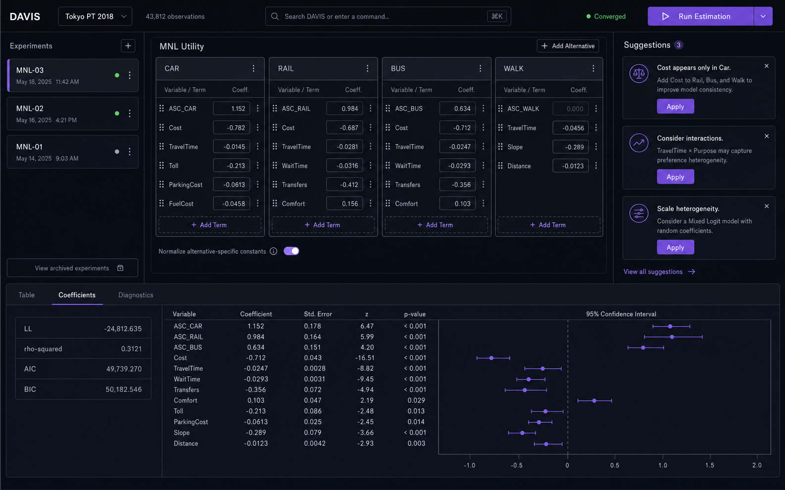
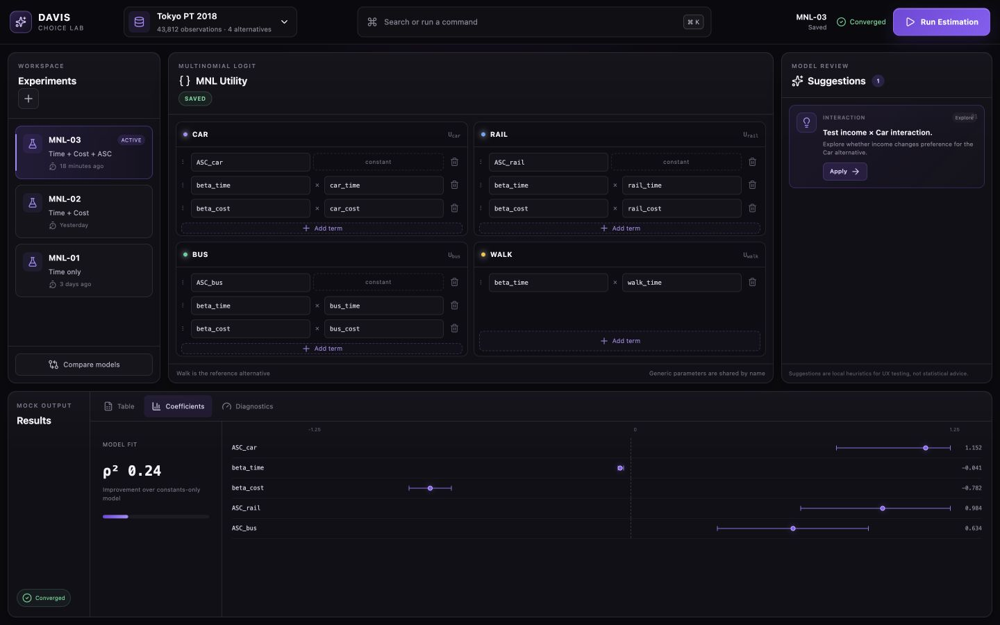

# DAVIS GUI prototype

An interactive, desktop-first UX prototype for exploring how DAVIS could support
discrete-choice model specification, review, estimation, and comparison.

> **Mock data only.** This app does not connect to DAVIS Python code, `dataset_cli`,
> a backend, an API, or a real estimator. All datasets, suggestions, experiments,
> and results are deterministic frontend fixtures.



The implemented interface was also reviewed at both target desktop sizes:



The 1280×800 review capture is available at
[`docs/screenshots/davis-gui-1280x800.png`](docs/screenshots/davis-gui-1280x800.png).

## Run locally

Requirements: Node.js 20 or newer and npm.

```bash
cd apps/davis-gui
npm install
npm run dev
```

Vite serves the app at `http://127.0.0.1:4173`.

## Validate

```bash
npm run lint
npm run typecheck
npm run build
npx playwright install chromium
npm run test:e2e
```

Playwright starts the Vite development server automatically for the E2E suite.

## Prototype interactions

- Open the global command palette with <kbd>Cmd</kbd>/<kbd>Ctrl</kbd> + <kbd>K</kbd>.
- Switch between three mock datasets.
- Edit coefficient and variable terms for Car, Rail, Bus, and Walk utilities.
- Apply model suggestions and see the specification change immediately.
- Run a short simulated estimation whose output depends on the specification.
- Restore the utility, suggestions, metrics, and coefficient table for MNL-01–03.
- Compare experiments or inspect Table, Coefficients, and Diagnostics results.

## Architecture

```text
src/
  features/       Interactive UI grouped by user workflow
  mock/           Datasets, specifications, suggestions, experiments, results
  services/       Small frontend-only data and estimation abstractions
  App.tsx         Application state and cross-feature commands
e2e/              Playwright user-flow tests
docs/             Visual concept and browser-review screenshots
```

The UI calls `getDatasets`, `getExperiments`, `getSuggestions`,
`applySuggestion`, and `runEstimation` from `src/services`. Their current
implementations import local fixtures only. A future integration can provide
HTTP-backed adapters behind those functions without changing the feature
components. These modules intentionally do **not** define a backend contract.

## Known limitations

- State resets on reload; experiments cannot be persisted or renamed.
- Estimation, diagnostics, and suggestions are UX fixtures, not scientific output.
- The structured editor does not parse arbitrary utility expressions.
- The prototype is optimized for desktop and compact laptop viewports, not phones.
