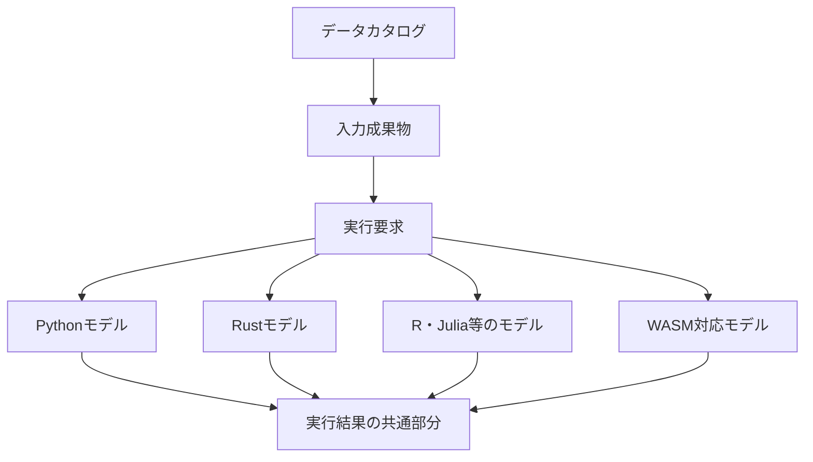
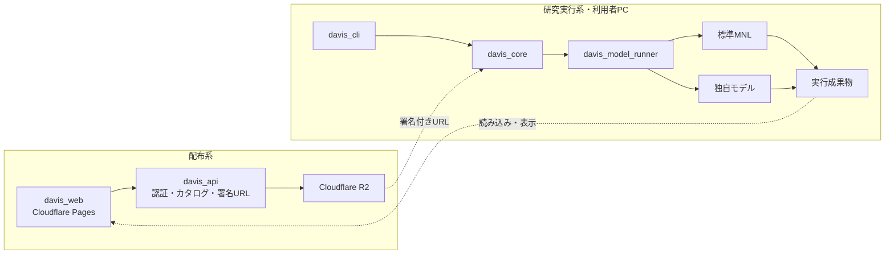

# Davis 交通行動モデル研究プラットフォーム構想

> 状態: Draft 0.4
>
> 作成日: 2026-08-17
>
> 最終更新日: 2026-08-17
>
> 対象: Davisを，データ配布ツールから，交通行動モデルを実装・推定・比較・再現するための研究プラットフォームへ発展させる計画
>
> 原則: 未確定事項を推測で補わず，本書内で「要確認」と明示する

## 1. 構想の再定義

Davisの当面の利用者を，交通行動モデルとプログラミングに関する基礎知識を持ち，既存モデルを読み，必要に応じてコードを編集できる研究者・学生とします．

Davisの目標を，次の1文に定めます．

> 研究者がデータを取得・整形し，既存の交通行動モデルを実行するだけでなく，その実装を変更して新しいモデルコンポーネントを作成し，同じ方法で検証・比較・再現できる基盤を提供する．

初期段階では，対話型ウィザードやノーコード化を中心に置きません．Webは，利用者の分析内容を質問によって決める画面ではなく，データ，変換，モデル，実行結果を扱う研究用ワークベンチとします．初心者向け支援は，将来，テンプレート，初期値，説明，検証メッセージとして追加します．

標準MNLはDavisに組み込まれた唯一のモデルではありません．モデルコンポーネントAPIの参考実装であり，研究者が複製・変更して新しいモデルを作るためのひな型です．

## 2. 優先順位

### 2.1. 優先するもの

- 現行`davis-cli`から取得できるすべてのデータを，引き続き取得できること
- データの意味，出典，利用条件，版，ハッシュを機械可読にすること
- 標準MNLのコードを読んで変更できること
- 変更したモデルを，Davis本体をフォークせず，新しいコンポーネントとして登録できること
- 入力，設定，実装版，依存環境，結果を保存し，再実行できること
- Python，Rustなど，モデルに適した言語を選べること
- Web，CLI，PCアプリが，同じデータセットと実行成果物を扱えること
- 共通化のためにモデル内部の構造を固定しないこと

### 2.2. 初期段階では優先しないもの

- 学術知識のない利用者が，質問に答えるだけで任意のモデルを作れること
- すべてのモデルをブラウザだけで実行すること
- 任意の研究コードを共通フォームですべて編集できること
- すべてのデータを同じ列名・同じ表構造へ強制的に変換すること
- すべての推定結果を同じグラフで完全に表現すること
- 外部開発者向けの中央プラグインマーケットプレイス
- 不特定の第三者コードをDavisのサーバー上で安全に実行すること

### 2.3. MVPの成功条件

1. 現行`davis-cli`で取得できる全データセットと関連文書を，新しい経路からも取得できる
2. 各データセットの説明，ファイル一覧，版，サイズ，SHA-256，利用条件を確認できる
3. WebとCLIが同じカタログを利用する
4. 既存MNLを独立した標準モデルコンポーネントとして実行できる
5. 標準MNLから新しいコンポーネントを生成し，コードを変更してローカル実行できる
6. 実行要求と結果を，版付きのファイル契約として保存できる
7. 入力データ，設定，モデル，依存環境の版を記録できる
8. 標準係数表を出力するモデルについて，共通の結果表示ができる
9. 現行の`davis list`，`davis info`，`davis get`相当の機能を維持する

ブラウザ内MNL推定は有用ですが，研究モデルの拡張性を犠牲にしてまでMVPへ含めません．標準MNLのWASM版は，コンポーネント契約を変えずに後から追加します．

## 3. 接続と自由度のトレードオフ

### 3.1. 細い共通部分を安定させる

接続には共通規約が必要です．一方，すべてを共通APIへ押し込むと，新しい数式，データ構造，最適化方法，出力を追加しにくくなります．そこで，Davisは少数の安定した契約だけを中央に置きます．



中央で共通化するのは，次の4点に限定します．

1. データセットとファイルを識別する`DatasetManifest`
2. モデルコンポーネントを識別する`ModelManifest`
3. 入力成果物と設定を渡す`RunRequest`
4. 状態，来歴，標準成果物の場所を返す`RunResult`

効用関数，選択確率，尤度，勾配，最適化器，内部クラス構成は共通契約に含めません．これらは各モデルコンポーネントが自由に実装します．

### 3.2. 共通化の境界

| 対象 | 方針 | 理由 |
| --- | --- | --- |
| データセットID，版，ハッシュ | 共通化する | 取得と再現に不可欠 |
| 実行ID，状態，時刻 | 共通化する | WebとCLIで扱うために必要 |
| モデルID，版，実装ハッシュ | 共通化する | 比較と再現に不可欠 |
| 入出力ファイル参照 | 共通化する | 言語間接続に必要 |
| 係数表の基本列 | 出力できるモデルだけ共通化する | 一般的な結果を可視化できる |
| 効用・尤度のクラス設計 | 共通化しない | モデルの発想を制限する |
| 最適化器 | 推奨実装は提供するが強制しない | 独自推定法を許容する |
| 全モデルの設定項目 | 共通化しない | モデル固有設定を許容する |
| モデル固有の結果 | 名前空間だけ共通化する | 新しい成果物を保持する |
| Python・Rustの関数ABI | 共通化しない | 言語と版への結合を避ける |

### 3.3. 抽象化を追加する条件

将来必要かもしれないという理由だけで，共通インターフェースを増やしません．次を満たした場合に追加します．

- 実際に2つ以上の異なる実装が存在する
- 共通化により利用者の処理が明確に簡単になる
- モデル固有の機能を失わない
- 互換性試験を用意できる

R2とローカルファイルの両方を使うため，ストレージ境界は早期に必要です．一方，MNLしか存在しない段階で，あらゆる離散選択モデルの内部クラス階層を決める必要はありません．

## 4. 研究ワークフロー

### 4.1. データを取得して標準MNLを実行する

```bash
davis dataset list
davis dataset get jp-pt-tokyo@2008-r1 --output ./data
davis model run davis/mnl \
  --input ./data/choice-data.parquet \
  --config ./model.yaml \
  --output ./runs/mnl-001
```

Webでは，同じカタログを検索し，説明と利用条件を確認してデータを取得します．結果ディレクトリをWebへ読み込めば，共通の係数表や診断を表示できます．

### 4.2. MNLを変更して新しいモデルを作る

```bash
davis model create my-scale-mnl --from davis/mnl-python
cd my-scale-mnl
```

```text
my-scale-mnl/
  davis-model.yaml
  pyproject.toml
  uv.lock
  src/
    my_scale_mnl/
      model.py
      estimate.py
      predict.py
  tests/
    test_reference_case.py
  examples/
    model.yaml
```

研究者は，必要な部分だけを変更します．

- 効用関数
- 選択確率
- パラメーター構造
- 対数尤度
- 正則化項
- 最適化器
- 推定後の指標や予測

変更後はDavis本体へコードを追加せず，ローカルコンポーネントとして実行します．

```bash
davis model validate .
davis model test .
davis model run . \
  --input ../data/choice-data.parquet \
  --config ./examples/model.yaml \
  --output ../runs/scale-mnl-001
```

### 4.3. モデルを共有する

モデルは独立したGitリポジトリとして共有できます．

```bash
davis model install git+https://github.com/example-lab/my-scale-mnl
```

再現時にはGit commit，パッケージ版，ロックファイルのハッシュを記録します．中央レジストリはMVPに含めず，ローカルパスとGit URLから始めます．

## 5. 全体アーキテクチャ

### 5.1. 配布系と研究実行系を分ける

データ配布はWebサービスとして安定運用する必要があります．一方，研究モデルは頻繁に変更され，任意コードを含みます．両者を同じ実行環境へ押し込みません．



MVPでは，任意のモデルコードは利用者PCで実行します．Cloudflare Pages上のWebアプリは，Pythonや任意の実行可能ファイルを直接起動できません．将来，公式WASMモデルのブラウザ実行と，PCアプリからのネイティブモデル実行を追加します．この違いはモデルの`runtime`能力として明示します．

### 5.2. コンポーネントの責務

| コンポーネント | 責務 | MVP |
| --- | --- | --- |
| `davis_core` | カタログ，成果物，実行要求，来歴を扱う中核 | P0 |
| `davis_catalog` | `dataset.yaml`の検証，索引，検索，版管理 | P0 |
| `davis_api` | 認証，カタログ配信，R2署名付きURL | P0 |
| `davis_web` | カタログ，ダウンロード，設定・結果の閲覧 | P0 |
| `davis_cli` | データ取得，モデル作成・検証・実行 | P0 |
| `davis_model_api` | 3つのモデル関連契約のスキーマ | P0 |
| `davis_model_runner` | モデル起動，入力解決，ログ，結果検証 | P0 |
| `davis_mnl` | 標準MNLの参考コンポーネント | P0 |
| `davis_model_sdk_python` | Pythonモデル向け補助関数と型 | P0 |
| `davis_fmt` | 変換レシピと外部変換コードの実行 | P1 |
| `davis_viz` | 共通結果とモデル固有表示の接続 | 最小機能をP0 |
| `davis_app` | Web UIとローカルランナーの統合 | P1 |
| `davis_remote_runner` | 隔離されたサーバー実行 | P2以降 |

## 6. モデルコンポーネント契約

### 6.1. プロセスとファイルを境界にする

モデルと言語をまたぐ境界では，関数ABIや継承クラスではなく，実行可能なプロセスとファイルを使います．

```text
モデルランナー
  ├── request.jsonを作成
  ├── 入力をローカルパスへ解決
  ├── モデルプロセスを起動
  └── output/run-result.jsonを検証

モデルコンポーネント
  ├── request.jsonを読む
  ├── 独自の方法で推定
  ├── 標準成果物を可能な範囲で出力
  └── 独自成果物をextensionsへ出力
```

これにより，Python，Rust，R，Julia等を同じDavisから起動できます．

### 6.2. `ModelManifest`

```yaml
api_version: davis.model/v1alpha1
id: example-lab/scale-mnl
name: Scale-adjusted MNL
version: 0.1.0

runtime:
  kind: python
  command: ["uv", "run", "python", "-m", "scale_mnl"]
  lockfile: uv.lock

operations: [validate, estimate, predict]

inputs:
  - name: choice_data
    media_types: [application/vnd.apache.parquet]
    required: true

config_schema: schemas/config.schema.json

outputs:
  standard: [parameters, covariance, metrics, predictions]
  extensions: [estimated_scales]
```

`runtime.kind`は`python`，`native`，`wasm`，`container`を想定し，MVPは`python`と`native`から始めます．

### 6.3. `RunRequest`

```json
{
  "api_version": "davis.run/v1alpha1",
  "run_id": "run_01...",
  "operation": "estimate",
  "component": {
    "id": "example-lab/scale-mnl",
    "version": "0.1.0",
    "source_revision": "<git-commit>"
  },
  "inputs": {
    "choice_data": {
      "path": "/resolved/input/choice-data.parquet",
      "sha256": "<hash>"
    }
  },
  "config": {
    "path": "/resolved/input/model.yaml",
    "sha256": "<hash>"
  },
  "output_directory": "/resolved/output"
}
```

R2 URLや資格情報はモデルへ渡しません．`davis_core`が入力を取得・検証し，変更不能なローカル参照として渡します．

### 6.4. 入力データ

標準MNLの推奨入力はlong形式のParquetです．`case_id`，`alternative_id`，`chosen`，`available`に相当する列を設定で対応付けます．ただし，この形をすべてのモデルへ強制しません．モデルは複数表，ネットワーク，GeoJSON，行列等を追加入力として宣言できます．

```yaml
inputs:
  - name: choices
    media_types: [application/vnd.apache.parquet]
  - name: network
    media_types: [application/vnd.apache.parquet]
  - name: zones
    media_types: [application/geo+json]
```

ファイル交換はParquetを第一候補とし，高速転送が必要になった場合はArrow IPCを追加します．pandasのDataFrame自体は契約にしませんが，Python SDKでは簡単に読み込める補助関数を提供します．

### 6.5. `RunResult`

すべてのモデルが返す共通部分は，意図的に小さくします．

```json
{
  "api_version": "davis.result/v1alpha1",
  "run_id": "run_01...",
  "status": "succeeded",
  "component": {
    "id": "example-lab/scale-mnl",
    "version": "0.1.0",
    "source_revision": "<git-commit>"
  },
  "provenance": {
    "request_sha256": "<hash>",
    "environment_lock_sha256": "<hash>"
  },
  "artifacts": [
    {
      "role": "parameters",
      "path": "parameters.parquet",
      "media_type": "application/vnd.apache.parquet",
      "sha256": "<hash>"
    },
    {
      "role": "metrics",
      "path": "metrics.json",
      "media_type": "application/json",
      "sha256": "<hash>"
    }
  ],
  "extensions": {
    "example-lab/scale-mnl": {
      "estimated_scales": "estimated-scales.parquet"
    }
  }
}
```

`parameters.parquet`の基本列は`name`と`estimate`を必須とし，`std_error`，`statistic`，`p_value`，`lower`，`upper`を任意とします．この表を出力できるモデルは，`davis_viz`で係数表と信頼区間を共通表示できます．係数を持たないモデルには無理に強制せず，独自成果物を使います．

## 7. 標準MNLの位置付け

`davis_mnl`は，そのまま利用できる検証済みMNLであると同時に，新しいモデルを作るための読みやすい参考実装です．処理を過度に抽象化せず，次の流れをコード上で追いやすくします．

```text
データ読込
  ↓
パラメーター定義
  ↓
効用計算
  ↓
選択確率
  ↓
対数尤度
  ↓
最適化
  ↓
分散共分散・診断
  ↓
標準結果の出力
```

現在の`src/specific_model/mode_choice`には，Pythonによる`ModeChoiceModel`，`MNL`，LOS，Trip，推定・シミュレーションがあります．これを破棄せず，最初のコンポーネントへ移行します．現行の`main_mc.py`へ集中しているデータ読込，最適化，Hessian計算，表示，出力を分離します．ただし，分離した内部関数をDavis全体の必須APIにはせず，Python SDKの便利な実装として扱います．

標準MNLには，少なくとも次を求めます．

- log-sum-expによる数値安定化
- 収束判定と未収束警告
- 勾配の検証
- 分散共分散行列と標準誤差
- 対数尤度，null対数尤度，McFaddenのρ²，補正ρ²，AIC，BIC
- 識別不能，共線性，欠損，利用不能な選択肢の診断
- 現行実装および信頼できる参照実装との数値比較

変更モデルは，標準MNLと同じ統計量を必ず持つ必要はありません．各コンポーネントが，適用可能な診断と検証方法を明記します．

## 8. 言語方針

### 8.1. Pythonをモデル開発の第一経路とする

研究者によるモデル編集では，NumPy，SciPy，pandas，JAX，PyTorch等の資産と，試行のしやすさが重要です．既存モデルもPythonです．そのため，初期のモデルSDKと標準MNLはPythonを第一経路とします．

Pythonの版問題は，全体から排除するのではなく，次の方法でコンポーネント内へ隔離します．

- コンポーネントごとに`pyproject.toml`と`uv.lock`を持つ
- Davis本体とモデルの依存環境を分ける
- `davis model run`が必要な環境を構築・選択する
- 結果へPython版とロックファイルのハッシュを記録する
- 長期保存や共有が必要な場合はOCIイメージも作成する

### 8.2. Rustを基盤へ用いる

Rustは，単一バイナリCLI，ストレージ接続，カタログ検証，モデルプロセス管理，ハッシュ計算，成果物管理，将来の公式WASMモデルへ用います．モデル契約自体はRustを要求しません．

GoもAPIには適していますが，Arrow，表処理，数値計算，WASMを同じ言語で共有する観点から，現時点ではRustを第一候補とします．

### 8.3. Web実行

任意のPythonコードをCloudflare Pages上で直接実行することは標準経路にしません．モデルごとに実行能力を宣言します．

```yaml
runtime_capabilities:
  native_local: true
  browser_wasm: false
  remote: false
```

公式RustモデルをWASMへビルドできた場合だけ`browser_wasm: true`とします．Web対応を理由に研究モデルの言語や内部設計を制限しません．

## 9. データカタログとストレージ

2026-08-17時点の`data/`には，256個のDVC管理対象と177個の`*.schema.yaml`があります．DVCメタデータ上の合計サイズは約8.66 GiBで，最大の単一ファイルは約1.37 GiBです．

MVPでは，現在の全取得対象をカタログへ掲載し，新しい経路から取得できるようにします．ただし，掲載と，特定モデルへの直接入力可否は分けて表示します．

```yaml
capabilities:
  catalog: ready
  download: ready
  preview: limited
  known_recipes: [pt-to-choice-long-v1]
  known_models:
    davis/mnl:
      status: requires_transform
```

`dataset.yaml`の必須項目は，ID，版，表示名，利用条件，アクセス区分，ファイルのパス・型・サイズ・ハッシュに絞ります．列の説明，意味，変換レシピは段階的に追加し，メタデータの多さで登録自体を妨げないようにします．

本番配布はCloudflare R2を第一候補とし，WebとCLIは認証後の署名付きURLから取得します．保存先はS3互換ストレージまたはローカルファイルへ交換できる境界を持ちます．DVCは現行データの移行，管理者同期，既存研究の再現に残しますが，一般参加者の必須ランタイムにはしません．

アクセスはCloudflare Accessを第一候補とします．`dataset.yaml`には`public`，`authenticated`，`cohort`，`admin`の区分を記録し，MVPでは`cohort`を既定とします．

## 10. `davis_fmt`と`davis_viz`

### 10.1. `davis_fmt`

`davis_fmt`は，すべてのデータを万能形式へ変換するものではありません．元データから，特定モデルが要求する入力を再現可能に作ります．

拡張方法は次の2段階です．

1. 列名変更，型変換，値変換，結合，wide・long変換は宣言的レシピで記述する
2. レシピで表現しにくい処理は，Python，Rust等の変換コンポーネントとして実装する

任意コードをYAML内へ埋め込まず，独立した版付きコンポーネントとして参照します．

### 10.2. `davis_viz`

可視化は次の3層に分けます．

1. 全実行に共通する状態，来歴，ログ，成果物一覧
2. 標準係数表，適合度，予測値等，対応モデルに共通する表示
3. モデルが提供する固有の表，Vega-Lite仕様，HTML等

標準MNLを少し変更したモデルが`parameters.parquet`と`metrics.json`を出力すれば，共通表示を利用できます．新しいモデル固有の結果は`extensions`から表示します．Vega-Liteを第一候補とし，Matplotlibは研究者独自の可視化で任意に使えるようにします．

## 11. Web，CLI，PCアプリ

### 11.1. Web

WebはCloudflare Pagesへ配置できるTypeScriptアプリとし，次を提供します．

- データカタログの検索
- 説明，版，ファイル，利用条件の確認
- 認証済みデータのダウンロード
- プロジェクト定義とモデル設定ファイルの編集
- 実行結果ディレクトリの読み込み
- 共通係数表，診断，モデル固有成果物の表示
- WASM対応モデルのブラウザ内実行

画面はウィザードではなく，`Dataset`，`Transform`，`Model`，`Run`，`Results`を自由に移動できるワークベンチとします．Webで表現できない設定はYAML・JSONを直接扱います．

### 11.2. CLI

研究モデルの作成と実行は，CLIを最初の正式経路とします．

```text
davis dataset list
davis dataset info <id>@<version>
davis dataset get <id>@<version>
davis model list
davis model create <name> --from <template>
davis model validate <component>
davis model test <component>
davis model run <component> --input <file> --config <file>
davis run inspect <run-directory>
davis run compare <run-a> <run-b>
```

### 11.3. PCアプリ

PCアプリはP1とします．Tauri等でWeb UIとローカルランナーを接続し，ブラウザでは起動できないPython・Rustコンポーネントを画面から実行します．それまでは，Webから設定を書き出し，CLIで実行し，結果をWebへ読み込む流れを利用します．

## 12. 推奨技術スタック

| 領域 | 第一候補 | 理由 |
| --- | --- | --- |
| Core，CLI，API，Runner | Rust | 単一バイナリ，型安全，プロセス管理，Arrow・WASMとの接続 |
| 標準モデルと研究モデルSDK | Pythonから開始 | 既存コード，数値計算資産，編集のしやすさ |
| モデル交換形式 | JSON・YAML＋Parquet | 言語とプロセスをまたいで扱える |
| 高速表転送 | Arrow IPC | 必要になった段階で追加できる |
| Web | TypeScript＋React系 | JSON Schemaと可視化資産 |
| 可視化 | Vega-Lite | Web向けで，仕様を成果物として保存できる |
| PC | Tauri | Web UIとRustランナーを再利用できる |
| ストレージ | Cloudflare R2 | S3互換，署名付きURL，Web配信との相性 |
| 認証 | Cloudflare Access | 参加者限定公開を短期間で開始できる |
| Python環境 | uv＋ロックファイル | コンポーネント単位で環境を固定しやすい |
| 長期再現・隔離 | OCIコンテナ | 必要なモデルだけ環境全体を固定できる |

PythonとRustのどちらか一方へ統一すること自体を目標にしません．研究コードの編集性と，基盤の配布・安定性で役割を分けます．

## 13. リポジトリ構成案

```text
davis/
  Cargo.toml
  crates/
    davis-core/
    davis-catalog/
    davis-api/
    davis-model-api/
    davis-model-runner/
    davis-cli/
    davis-viz/
  model-sdks/
    python/
  model-components/
    mnl-python/
    mnl-rust/             # P1以降の候補
  transform-components/
  apps/
    web/
    desktop/
  catalog/
    datasets/
  schemas/
    v1alpha1/
  examples/
    mnl-basic/
    custom-mnl/
  packages/
    dataset_cli/          # 移行期間中の既存CLI
  src/
    specific_model/       # 移行元の既存研究モデル
  docs/
    adr/
    davis-platform-concept.md
```

既存コードは互換試験と最初のコンポーネントの移行元として残し，新経路が動く前に移動・削除しません．

## 14. 実装の優先順位

### P0: 3〜5日で縦断経路を作る

#### Day 0: 安全確保と棚卸し

- 平文保存されているGoogle OAuthクライアントシークレットを失効・再発行する
- 現行マニフェストから，全取得対象，サイズ，ハッシュの基準一覧を作る
- データの利用条件と参加者向け再配布可否を確認する

#### Day 1: 最小契約とCLI骨格

- 4つの中央契約だけを定義する
- JSON Schemaと正常・異常例を作る
- Rust CLIからローカルのモデルプロセスを起動する
- 既存DVCメタデータと列スキーマからカタログを生成する

#### Day 2: 標準MNLコンポーネント

- 現行Python MNLを独立コンポーネントへ移す
- `uv.lock`で実行環境を固定する
- `RunRequest`を読み，共通結果とログを出力する
- 合成データと現行実装による回帰試験を作る
- `davis model create --from davis/mnl-python`を実装する

#### Day 3: カタログWebと配布API

- Cloudflare Accessを設定する
- 一覧・詳細・署名付きダウンロードURLのAPIを作る
- Webへカタログ，詳細，ダウンロード画面を作る
- Webで実行結果を読み込み，係数表とログを表示する

#### Day 4〜5: 全データ互換性と拡張例

- 現行の全取得対象をR2へ移行する
- 全ファイルのサイズとSHA-256を照合する
- `list`，`info`，`get`相当の互換試験を実行する
- 標準MNLを少し変更したサンプルコンポーネントを1つ作る
- 標準MNLと変更モデルを同じCLIで実行・比較する
- モデル開発者向けREADMEとデバッグ手順を作る

短期間では，新しい数値計算エンジン，WASM，PCアプリ，多言語SDKを同時に完成させません．現行資産を利用し，データ取得とモデル追加の縦断経路を通すことを優先します．

### P1: MVP後の1〜3週間

- 標準MNLの数値処理と診断の改善
- `davis_fmt`の宣言的レシピとPython変換コンポーネント
- 共通係数表，予測値，実行比較
- Tauri PCアプリとローカルランナーの接続
- RustモデルSDKまたは最小サンプル
- 標準MNLのRust・WASM版の実現可能性検証
- Git URLからのモデルインストール
- モデル設定スキーマからのWebフォーム生成
- ロバスト標準誤差，重み，パネル等の標準MNL拡張

### P2: 1〜3か月以降

- Nested Logit，Mixed Logit，Recursive Logit等の参考コンポーネント
- OCIコンテナ・WASIランナー
- 隔離されたサーバー推定
- モデル固有のWeb可視化拡張
- 実験比較，シナリオ管理，成果物共有
- 組織，プロジェクト，権限，利用規約同意の管理
- モデルレジストリと署名・信頼情報

## 15. 試験戦略

### 15.1. データ配布

- 現行マニフェストの全対象を新経路から取得できる
- ファイルサイズとSHA-256が一致する
- 未認証者と権限のない参加者が取得できない
- R2とローカルストレージが同じカタログ契約を満たす

### 15.2. モデル契約

- Pythonとネイティブ実行ファイルが，同じ`RunRequest`を読める
- 正常終了時に`RunResult`と宣言済み成果物が存在する
- 不正な結果，欠落成果物，異なるハッシュを検出できる
- コンポーネント固有フィールドを失わず保持できる
- 古い互換版の結果を新しいWeb・CLIが読める

### 15.3. 数値検証

- 手計算可能な小規模な2項・多項Logit
- 合成データによる推定値の回復
- 現行実装および別の信頼できる実装との尤度・係数比較
- 極端な効用，共線性，完全分離，未収束の診断
- 標準MNLを変更した例が，独立コンポーネントとして動く

## 16. 主なリスクと判断

| リスク | 影響 | 対応 |
| --- | --- | --- |
| 接続契約を増やし過ぎる | 冗長になり，研究コードを書きにくい | 4つの中央契約に絞り，内部関数を標準化しない |
| 契約が少な過ぎる | Web，CLI，可視化が分断される | 状態，来歴，成果物参照，任意の標準表を共通化する |
| Python環境が壊れる | 再現・実行できない | コンポーネント単位の`uv.lock`と実行版記録 |
| Rustだけに寄せる | 研究者がモデルを追加しにくい | Python SDKを第一経路とする |
| Web対応を強制する | 高度なモデルを追加できない | 実行能力を宣言し，CLI・PC・WASMを使い分ける |
| 共通結果が固定的過ぎる | 新しい成果を表現できない | 必須部分を小さくし，`extensions`を持つ |
| 共通結果が自由過ぎる | `davis_viz`が表示できない | 係数，指標，予測値の任意標準表を定義する |
| 任意コードのサーバー実行 | 情報漏えい，サービス停止 | 当面は信頼されたローカル実行に限定する |
| 数日で新MNLを再実装する | 数値的に不確かになる | 現行Python実装を接続し，段階的に改善する |
| R2移行でデータが欠落する | 現行CLIより機能が低下する | 全件取得監査をリリース条件にする |

## 17. 先に作るADR

1. ADR-0001: 中央契約を4種類に限定するか
2. ADR-0002: モデル拡張を動的ライブラリではなく，プロセス＋ファイル契約にするか
3. ADR-0003: モデル開発をPython，基盤実装をRustから始めるか
4. ADR-0004: Python環境をコンポーネント単位の`uv.lock`で隔離するか
5. ADR-0005: 共通結果を小さな`RunResult`と任意の標準成果物に分けるか
6. ADR-0006: R2を第一ストレージとし，DVCを管理・移行用途へ限定するか
7. ADR-0007: 参加者限定アクセスをCloudflare Accessで実装するか
8. ADR-0008: 現行全データのダウンロード互換性をMVPの条件とするか
9. ADR-0009: 任意モデルのブラウザ実行を必須とせず，能力をモデルごとに宣言するか

## 18. 確認済み事項と残る確認事項

### 18.1. 確認済み事項

1. 当面は参加者限定とし，将来は別の参加者群や一般公開へ拡張可能にする
2. 現在の`data/`にある全データをカタログ対象にする
3. 現行`davis-cli`で取得できる全データをMVPでもダウンロード可能にする
4. 推定は利用者PC内を基本とし，将来サーバー実行を追加可能にする
5. 当面の利用者は，一定の研究能力を持ち，設定やコードを編集できる利用者とする
6. MNLは固定機能ではなく，新しいモデルコンポーネントを作る参考実装とする
7. Webは強い対話型ではなく，設定と成果物を直接扱えるワークベンチとする
8. 接続は少数の安定した境界に限定し，モデル内部は共通化しない

### 18.2. 残る確認事項

1. 標準MNLの初期入力として，現行の`los.csv`＋`trip.csv`を維持するか，long形式Parquetを主形式にするか
2. 最初の変更モデル例として，どの研究上の変更を採用するか
3. Python SDKをNumPy＋SciPyの最小依存にするか，JAX等を採用するか
4. 標準MNLにP0で重み，パネル，ロバスト標準誤差を含めるか
5. Webからローカルモデルを実行する接続を，PCアプリとローカルHTTPランナーのどちらで実現するか
6. 同時利用者数，ダウンロード量，R2の費用上限
7. Davis本体とモデルコンポーネントのライセンス

## 19. 直近の着手順

1. 4つの最小契約を作り，標準MNLと変更モデルの両方で不足がないか確認する
2. 現行データの全取得対象，サイズ，ハッシュを棚卸しする
3. 現行MNLを，入出力を変えずにモデルプロセスとして起動する薄いアダプターを作る
4. 標準MNLから複製した変更モデルを1つ作り，同じランナーから実行する
5. 両モデルの結果を共通`RunResult`として読み，係数表とログを表示する
6. カタログAPI，Cloudflare Access，R2署名付きダウンロードを接続する
7. Webへカタログ，ダウンロード，結果閲覧を実装する
8. 全データのR2移行と取得監査を完了する

最初に大規模な抽象基盤を作りません．現行MNLと実際に変更したモデルの2つを縦に通し，両方に本当に必要だった接続だけを共通仕様として確定します．

## 20. 参考資料

- [Cloudflare R2の仕組み](https://developers.cloudflare.com/r2/how-r2-works/)
- [Cloudflare R2のS3 API](https://developers.cloudflare.com/r2/api/s3/)
- [Cloudflare R2の署名付きURL](https://developers.cloudflare.com/r2/api/s3/presigned-urls/)
- [Cloudflare AccessのメールOne-time PIN](https://developers.cloudflare.com/cloudflare-one/integrations/identity-providers/one-time-pin/)
- [Cloudflare Access Policies](https://developers.cloudflare.com/cloudflare-one/access-controls/policies/)
- [DVCのS3およびS3互換ストレージ設定](https://doc.dvc.org/user-guide/data-management/remote-storage/amazon-s3)
- [Apache Arrow Columnar Format](https://arrow.apache.org/docs/format/Columnar.html)
- [Vega-Lite Documentation](https://vega.github.io/vega-lite/docs/)
- [uv Documentation](https://docs.astral.sh/uv/)
- [Tauri Architecture](https://tauri.app/concept/architecture/)
