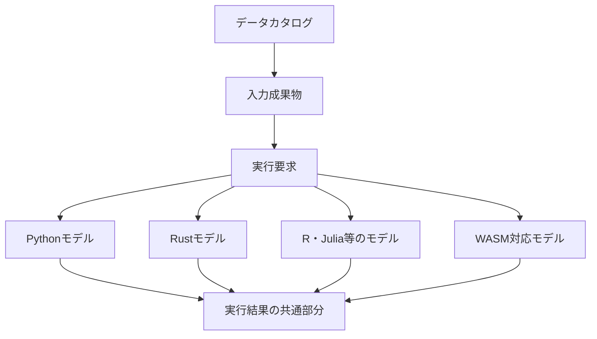
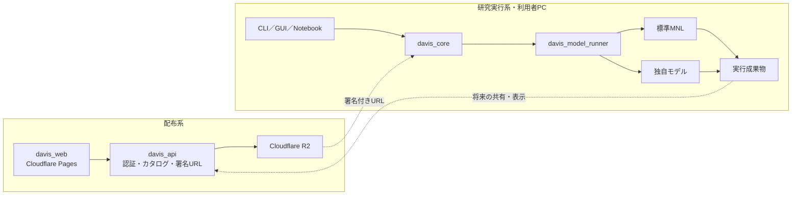

# Davis 交通行動モデル研究プラットフォーム構想

> 状態: Draft 0.7
>
> 作成日: 2026-08-17
>
> 最終更新日: 2026-08-19
>
> 対象: Davisを，データ配布ツールから，交通行動モデルを実装・推定・比較・再現するための研究プラットフォームへ発展させる計画
>
> 原則: 未確定事項を推測で補わず，本書内で「要確認」と明示する

## 1. 構想の再定義

Davisの当面の利用者を，交通行動モデルとプログラミングに関する基礎知識を持ち，既存モデルを読み，必要に応じてコードを編集できる研究者・学生とします．

Davisの目標を，次の1文に定めます．

> データの発見・取得から，整形，モデル実行，結果整理，再現までの共通作業をDavisが担い，研究者が「どのようなモデルを構築するか」に集中できる基盤を提供する．

初期段階では，対話型ウィザードやノーコード化を中心に置きません．最初に公開するWebの責務は，実データファイルごとの`*.schema.yaml`を使った閲覧，検索，絞り込み，ダウンロードに限定します．データ取得後の整形，推定，可視化はローカル実行を基本としますが，その入口をCLIへ固定しません．

標準MNLはDavisに組み込まれた唯一のモデルではありません．モデルコンポーネントAPIの参考実装であり，研究者が複製・変更して新しいモデルを作るためのひな型です．

通常の研究で利用者が編集する場所は，原則としてモデルコンポーネントとその設定だけにします．データ取得，キャッシュ，既知の整形処理，入力検証，実行環境の準備，成果物整理，来歴記録はDavisが担います．

## 2. 優先順位

### 2.1. 優先するもの

- 現行`davis-cli`から取得できるすべてのデータを，引き続き取得できること
- データの意味，出典，利用条件，版，ハッシュを機械可読にすること
- Web上で各実データの`*.schema.yaml`を読み，ファイル属性と列情報を組み合わせて検索・絞り込みできること
- 単一の`Run`ユースケースから，入力解決，既知の整形，推定，結果整理を一括実行できること
- 標準MNLのコードを読んで変更できること
- 変更したモデルを，Davis本体をフォークせず，新しいコンポーネントとして登録できること
- 入力，設定，実装版，依存環境，結果を保存し，再実行できること
- Python，Rustなど，モデルに適した言語を選べること
- 将来のWeb実行，PCアプリ，サーバー実行が，同じ中核処理と成果物を再利用できること
- 共通化のためにモデル内部の構造を固定しないこと

### 2.2. 初期段階では優先しないもの

- 学術知識のない利用者が，質問に答えるだけで任意のモデルを作れること
- すべてのモデルをブラウザだけで実行すること
- Web上でのデータ整形，モデル設定，推定，結果表示
- 任意の研究コードを共通フォームですべて編集できること
- すべてのデータを同じ列名・同じ表構造へ強制的に変換すること
- すべての推定結果を同じグラフで完全に表現すること
- 外部開発者向けの中央プラグインマーケットプレイス
- 不特定の第三者コードをDavisのサーバー上で安全に実行すること

### 2.3. MVPの成功条件

1. 現行`davis-cli`で取得できる全データセットと関連文書を，新しい経路からも取得できる
2. 各実データファイルについて，対応する`*.schema.yaml`の名称，説明，地域，年，列名，列型，列説明，ハッシュ，利用条件を確認できる
3. Webで`*.schema.yaml`のファイル属性と列情報による検索・絞り込みを行い，対象データをダウンロードできる
4. Web，CLI，その他のクライアントが同じカタログユースケースを利用できる
5. 少なくとも1つの参照クライアントから`RunRequest`を実行し，既知の整形，入力検証，モデル実行，成果物整理を一括で行える
6. 既存MNLを独立した標準モデルコンポーネントとして実行できる
7. 標準MNLから新しいコンポーネントを生成し，コードを変更してローカル実行できる
8. 実行要求と結果を，版付きのファイル契約として保存できる
9. 入力データ，設定，モデル，依存環境の版を記録できる
10. 標準係数表を出力するモデルについて，クライアントに依存しない共通のHTML・CSV・JSONを生成できる
11. 現行の`davis list`，`davis info`，`davis get`相当の機能を維持する

ブラウザ内MNL推定は有用ですが，研究モデルの拡張性を犠牲にしてまでMVPへ含めません．標準MNLのWASM版は，コンポーネント契約を変えずに後から追加します．

## 3. 接続と自由度のトレードオフ

### 3.1. 細い共通部分を安定させる

接続には共通規約が必要です．一方，すべてを共通APIへ押し込むと，新しい数式，データ構造，最適化方法，出力を追加しにくくなります．そこで，Davisは少数の安定した契約だけを中央に置きます．



中央で共通化するのは，次の4点に限定します．

1. 既存`*.schema.yaml`を版付きで扱う`FileSchema`
2. モデルコンポーネントを識別する`ModelManifest`
3. モデルへ解決済み入力と設定を渡す`RunRequest`
4. 状態，来歴，標準成果物の場所を返す`RunResult`

利用者が記述する`project.yaml`はMVPに設けません．初回実行要求はCLI，GUI，SDK等のいずれから作成してもよく，Davisが解決済みの入力，整形，モデル，環境，出力を`run.json`へ自動記録します．再実行はこの記録を利用します．多数の条件を一括実行する必要が実際に生じた場合だけ，将来`experiment.yaml`等を任意機能として検討します．

効用関数，選択確率，尤度，勾配，最適化器，内部クラス構成は共通契約に含めません．これらは各モデルコンポーネントが自由に実装します．

### 3.2. 共通化の境界

| 対象 | 方針 | 理由 |
| --- | --- | --- |
| ファイルID，データ群，版，ハッシュ | 共通化する | 取得と再現に不可欠 |
| 実行ID，状態，時刻 | 共通化する | どのクライアントからも同じ実行を扱うために必要 |
| モデルID，版，実装ハッシュ | 共通化する | 比較と再現に不可欠 |
| 入出力ファイル参照 | 共通化する | 言語間接続に必要 |
| 係数表の基本列 | 出力できるモデルだけ共通化する | 一般的な結果を可視化できる |
| 効用・尤度のクラス設計 | 共通化しない | モデルの発想を制限する |
| 最適化器 | 推奨実装は提供するが強制しない | 独自推定法を許容する |
| 全モデルの設定項目 | 共通化しない | モデル固有設定を許容する |
| モデル固有の結果 | 名前空間だけ共通化する | 新しい成果物を保持する |
| Python・Rustの関数ABI | 共通化しない | 言語と版への結合を避ける |

### 3.3. 抽象化を追加する条件

将来必要かもしれないという理由だけで，共通インターフェースを増やしません．次を満たした場合に追加します．

- 実際に2つ以上の異なる実装が存在する
- 共通化により利用者の処理が明確に簡単になる
- モデル固有の機能を失わない
- 互換性試験を用意できる

R2とローカルファイルの両方を使うため，ストレージ境界は早期に必要です．一方，MNLしか存在しない段階で，あらゆる離散選択モデルの内部クラス階層を決める必要はありません．

## 4. 研究ワークフロー

### 4.1. 基本となる一本の流れ

```text
Webでデータを探す・`*.schema.yaml`を読む・ダウンロードする
  ↓
Davisの任意のクライアントからRunRequestを送る
  ├── データを取得またはキャッシュから解決
  ├── 既知の整形レシピを適用
  ├── モデル入力を検証
  ├── 指定されたモデルコンポーネントを実行
  ├── 結果とログを検証
  └── 再現情報と共通レポートを保存
  ↓
研究者はモデルコードとモデル設定を変更して再実行する
```

利用者が新しい研究モデルを考えるとき，データ取得処理，CSV読込，出力ディレクトリ管理，ハッシュ計算，結果ファイル生成をモデルごとに書き直さないことを目標にします．実行条件はDavisが`run.json`へ自動保存するため，再現性のためのプロジェクト設定ファイルを利用者に重ねて書かせません．CLIのコマンド例は，この共通ユースケースを呼ぶ一つの方法に過ぎません．

### 4.2. データを取得して標準MNLを実行する

```bash
davis dataset list
davis dataset get jp-pt-tokyo@2008-r1 --output ./data
davis run davis/mnl \
  --input trips=./data/trip.csv \
  --input los=./data/los.csv \
  --config ./model.yaml
```

Webからダウンロードしたファイルは`--input <role>=<path>`で指定します．CLIから直接取得する場合は，将来`catalog://<file-id>@<hash>`形式の参照も利用できるようにします．Davisは参照をローカルファイルへ解決し，必要な処理を順に実行します．

### 4.3. MNLを変更して新しいモデルを作る

```bash
davis model create my-scale-mnl --from davis/mnl-python
cd my-scale-mnl
```

```text
my-scale-mnl/
  davis-model.yaml
  pyproject.toml
  uv.lock
  src/
    my_scale_mnl/
      model.py
      estimate.py
      predict.py
  tests/
    test_reference_case.py
  examples/
    model.yaml
```

研究者は，必要な部分だけを変更します．

- 効用関数
- 選択確率
- パラメーター構造
- 対数尤度
- 正則化項
- 最適化器
- 推定後の指標や予測

変更後はDavis本体へコードを追加せず，ローカルコンポーネントとして実行します．

```bash
davis model validate .
davis model test .
davis run . \
  --input trips=../data/trip.csv \
  --input los=../data/los.csv \
  --config ./examples/model.yaml
```

このとき，取得，整形，入力検証，結果整理は標準MNLを使った場合と同じです．研究者が変更するのは，モデルコンポーネントとモデル固有設定だけです．

初回実行後は，生成された`run.json`から同じ条件を復元します．

```bash
davis rerun latest --model .
```

同じ操作は，将来のGUIやNotebookからも行えます．

```text
CLI
└── davis run ./my-model --input ...

GUI
└── モデルと入力を選択して「実行」

Python／Notebook
└── client.run(model="./my-model", inputs={...})

Remote API
└── POST /api/v1/runs
```

いずれも内部では同じ`RunRequest`を作り，同じ`RunResult`，`run.json`，成果物を受け取ります．

### 4.4. モデルを共有する

モデルは独立したGitリポジトリとして共有できます．

```bash
davis model install git+https://github.com/example-lab/my-scale-mnl
```

再現時にはGit commit，パッケージ版，ロックファイルのハッシュを記録します．中央レジストリはMVPに含めず，ローカルパスとGit URLから始めます．

## 5. 全体アーキテクチャ

### 5.1. 配布系と研究実行系を分ける

データ配布はWebサービスとして安定運用する必要があります．一方，研究モデルは頻繁に変更され，任意コードを含みます．両者を同じ実行環境へ押し込みません．



MVPでは，任意のモデルコードは利用者PCで実行します．最初の参照クライアントは実装速度を理由にCLIとしますが，`davis_core`と`davis_model_runner`はCLIの表示・引数形式へ依存させません．Cloudflare Pages上のWebアプリは，Pythonや任意の実行可能ファイルを直接起動できないため，将来はWASM，ローカル実行サービス，PCアプリ，遠隔ランナーのいずれかを同じ`RunRequest`へ接続します．

### 5.2. コンポーネントの責務

| コンポーネント | 責務 | MVP |
| --- | --- | --- |
| `davis_core` | カタログ，成果物，実行要求，来歴を扱う中核 | P0 |
| `davis_catalog` | `*.schema.yaml`の検証，列単位の索引，検索，ファイル対応付け | P0 |
| `davis_api` | 認証，カタログ配信，R2署名付きURL | P0 |
| `davis_web` | ファイル・列スキーマの検索，絞り込み，詳細，ダウンロード | P0 |
| `davis_cli` | 中核ユースケースを検証する最初の参照クライアント | P0 |
| `davis_model_api` | 3つのモデル関連契約のスキーマ | P0 |
| `davis_model_runner` | モデル起動，入力解決，ログ，結果検証 | P0 |
| `davis_mnl` | 標準MNLの参考コンポーネント | P0 |
| `davis_model_sdk_python` | Pythonモデル向け補助関数と型 | P0 |
| `davis_fmt` | 既知の変換レシピと外部変換コードの実行 | 最小機能をP0，拡張をP1 |
| `davis_viz` | 共通結果とモデル固有表示の接続 | 最小機能をP0 |
| `davis_app` | 同じ中核ユースケースを使うGUIクライアント | P1以降で検証 |
| `davis_remote_runner` | 隔離されたサーバー実行 | P2以降 |

### 5.3. APIを増やし過ぎず，将来の入口を増やす

API-firstを「すべての内部関数をHTTP化すること」とは捉えません．初期段階では，利用場所の異なる次の3境界だけを明確にします．

| 境界 | 形式 | 初期利用者 | 将来の利用者 |
| --- | --- | --- | --- |
| カタログAPI | HTTP＋OpenAPI | Web，参照CLI | 外部ポータル，Notebook，別組織のサービス |
| アプリケーションAPI | 言語非依存の要求・応答とRust実装 | 参照CLI，APIサーバー | PCアプリ，Notebook，サーバージョブ |
| モデル実行API | JSON＋Parquetのプロセス契約 | ローカルモデル | コンテナ，WASI，遠隔ランナー |

Webのためだけの検索ロジック，CLIのためだけのダウンロード・実行ロジックを作りません．`davis_catalog`と`davis_core`にユースケースを置き，Web，CLI，GUI，SDKは薄い入口にします．一方，細かな内部関数まで遠隔APIとして公開せず，実際に別プロセス・別サービスとの接続が必要な境界だけを版管理します．

この構成により，将来は中核を書き直さず，次を追加できます．

- 公開データ向けの一般カタログ
- 大学や自治体ごとの別Webフロントエンド
- Jupyter・Python・Rからのカタログ検索と実行
- PCアプリ
- サーバー推定と計算キュー
- 新しいストレージアダプター
- 新しい整形・モデル・可視化コンポーネント
- 実験比較・共有サービス

拡張可能性は，空の抽象インターフェースを先に大量に作ることではなく，ファイル・プロジェクト・実行の意味を安定させ，同じユースケースへ複数の入口を後付けできることによって確保します．

## 6. モデルコンポーネント契約

### 6.1. プロセスとファイルを境界にする

モデルと言語をまたぐ境界では，関数ABIや継承クラスではなく，実行可能なプロセスとファイルを使います．

```text
モデルランナー
  ├── request.jsonを作成
  ├── 入力をローカルパスへ解決
  ├── モデルプロセスを起動
  └── output/run-result.jsonを検証

モデルコンポーネント
  ├── request.jsonを読む
  ├── 独自の方法で推定
  ├── 標準成果物を可能な範囲で出力
  └── 独自成果物をextensionsへ出力
```

これにより，Python，Rust，R，Julia等を同じDavisから起動できます．

### 6.2. `ModelManifest`

```yaml
api_version: davis.model/v1alpha1
id: example-lab/scale-mnl
name: Scale-adjusted MNL
version: 0.1.0

runtime:
  kind: python
  command: ["uv", "run", "python", "-m", "scale_mnl"]
  lockfile: uv.lock

operations: [validate, estimate, predict]

inputs:
  - name: choice_data
    media_types: [application/vnd.apache.parquet]
    required: true

config_schema: schemas/config.schema.json

outputs:
  standard: [parameters, covariance, metrics, predictions]
  extensions: [estimated_scales]
```

`runtime.kind`は`python`，`native`，`wasm`，`container`を想定し，MVPは`python`と`native`から始めます．

### 6.3. `RunRequest`

```json
{
  "api_version": "davis.run/v1alpha1",
  "run_id": "run_01...",
  "operation": "estimate",
  "component": {
    "id": "example-lab/scale-mnl",
    "version": "0.1.0",
    "source_revision": "<git-commit>"
  },
  "inputs": {
    "choice_data": {
      "path": "/resolved/input/choice-data.parquet",
      "sha256": "<hash>"
    }
  },
  "config": {
    "path": "/resolved/input/model.yaml",
    "sha256": "<hash>"
  },
  "output_directory": "/resolved/output"
}
```

R2 URLや資格情報はモデルへ渡しません．`davis_core`が入力を取得・検証し，変更不能なローカル参照として渡します．

### 6.4. 入力データ

標準MNLの推奨入力はlong形式のParquetです．`case_id`，`alternative_id`，`chosen`，`available`に相当する列を設定で対応付けます．ただし，この形をすべてのモデルへ強制しません．モデルは複数表，ネットワーク，GeoJSON，行列等を追加入力として宣言できます．

```yaml
inputs:
  - name: choices
    media_types: [application/vnd.apache.parquet]
  - name: network
    media_types: [application/vnd.apache.parquet]
  - name: zones
    media_types: [application/geo+json]
```

ファイル交換はParquetを第一候補とし，高速転送が必要になった場合はArrow IPCを追加します．pandasのDataFrame自体は契約にしませんが，Python SDKでは簡単に読み込める補助関数を提供します．

### 6.5. `RunResult`

すべてのモデルが返す共通部分は，意図的に小さくします．

```json
{
  "api_version": "davis.result/v1alpha1",
  "run_id": "run_01...",
  "status": "succeeded",
  "component": {
    "id": "example-lab/scale-mnl",
    "version": "0.1.0",
    "source_revision": "<git-commit>"
  },
  "provenance": {
    "request_sha256": "<hash>",
    "environment_lock_sha256": "<hash>"
  },
  "artifacts": [
    {
      "role": "parameters",
      "path": "parameters.parquet",
      "media_type": "application/vnd.apache.parquet",
      "sha256": "<hash>"
    },
    {
      "role": "metrics",
      "path": "metrics.json",
      "media_type": "application/json",
      "sha256": "<hash>"
    }
  ],
  "extensions": {
    "example-lab/scale-mnl": {
      "estimated_scales": "estimated-scales.parquet"
    }
  }
}
```

`parameters.parquet`の基本列は`name`と`estimate`を必須とし，`std_error`，`statistic`，`p_value`，`lower`，`upper`を任意とします．この表を出力できるモデルは，`davis_viz`で係数表と信頼区間を共通表示できます．係数を持たないモデルには無理に強制せず，独自成果物を使います．

## 7. 標準MNLの位置付け

`davis_mnl`は，そのまま利用できる検証済みMNLであると同時に，新しいモデルを作るための読みやすい参考実装です．処理を過度に抽象化せず，次の流れをコード上で追いやすくします．

```text
データ読込
  ↓
パラメーター定義
  ↓
効用計算
  ↓
選択確率
  ↓
対数尤度
  ↓
最適化
  ↓
分散共分散・診断
  ↓
標準結果の出力
```

現在の`src/specific_model/mode_choice`には，Pythonによる`ModeChoiceModel`，`MNL`，LOS，Trip，推定・シミュレーションがあります．これを破棄せず，最初のコンポーネントへ移行します．現行の`main_mc.py`へ集中しているデータ読込，最適化，Hessian計算，表示，出力を分離します．ただし，分離した内部関数をDavis全体の必須APIにはせず，Python SDKの便利な実装として扱います．

標準MNLには，少なくとも次を求めます．

- log-sum-expによる数値安定化
- 収束判定と未収束警告
- 勾配の検証
- 分散共分散行列と標準誤差
- 対数尤度，null対数尤度，McFaddenのρ²，補正ρ²，AIC，BIC
- 識別不能，共線性，欠損，利用不能な選択肢の診断
- 現行実装および信頼できる参照実装との数値比較

変更モデルは，標準MNLと同じ統計量を必ず持つ必要はありません．各コンポーネントが，適用可能な診断と検証方法を明記します．

## 8. 言語方針

### 8.1. Pythonをモデル開発の第一経路とする

研究者によるモデル編集では，NumPy，SciPy，pandas，JAX，PyTorch等の資産と，試行のしやすさが重要です．既存モデルもPythonです．そのため，初期のモデルSDKと標準MNLはPythonを第一経路とします．

Pythonの版問題は，全体から排除するのではなく，次の方法でコンポーネント内へ隔離します．

- コンポーネントごとに`pyproject.toml`と`uv.lock`を持つ
- Davis本体とモデルの依存環境を分ける
- `davis run`が必要な環境を構築・選択する
- 結果へPython版とロックファイルのハッシュを記録する
- 長期保存や共有が必要な場合はOCIイメージも作成する

### 8.2. Rustを基盤へ用いる

Rustは，配布可能な実行ホスト，ストレージ接続，カタログ検証，モデルプロセス管理，ハッシュ計算，成果物管理，将来の公式WASMモデルへ用います．参照CLIも同じ実装を利用しますが，モデル契約と中核ユースケースはCLIを要求しません．

GoもAPIには適していますが，Arrow，表処理，数値計算，WASMを同じ言語で共有する観点から，現時点ではRustを第一候補とします．

### 8.3. Web実行

任意のPythonコードをCloudflare Pages上で直接実行することは標準経路にしません．モデルごとに実行能力を宣言します．

```yaml
runtime_capabilities:
  native_local: true
  browser_wasm: false
  remote: false
```

公式RustモデルをWASMへビルドできた場合だけ`browser_wasm: true`とします．Web対応を理由に研究モデルの言語や内部設計を制限しません．

## 9. ファイルスキーマカタログとストレージ

### 9.1. 既存`*.schema.yaml`をカタログの原本にする

2026-08-17時点の`data/`には，256個のDVC管理対象と177個の`*.schema.yaml`があります．DVCメタデータ上の合計サイズは約8.66 GiBで，最大の単一ファイルは約1.37 GiBです．

Webカタログの中心は，現在実データファイルごとに置かれている`<filename>.schema.yaml`です．現行スキーマには，主に次が含まれています．

- `name.ja`，`name.en`: ファイル内容の名称
- `description.ja`，`description.en`: ファイル全体の説明
- `city.ja`，`city.en`: 対象地域
- `year`: 対象年
- `license_.ja`，`license_.en`: 利用条件
- `hash_`: 対応する実データのハッシュ
- `columns[].name`: 列名
- `columns[].type_.name`: データ型
- `columns[].description.ja`，`columns[].description.en`: 列の説明

MVPでは，既存177ファイルを一括で別形式へ書き換えません．現在の形式を`v0`として読み込む索引生成器を作ります．将来フィールドを追加するときは，`schema_version`を持つ新形式を定義し，旧形式も読み続けられる移行処理を用意します．

### 9.2. ファイルとスキーマの対応

`foo.csv.schema.yaml`は`foo.csv`を説明するものとして対応付けます．DVC管理中で実体がローカルにない場合は，`foo.csv.dvc`からサイズ，保存対象，ハッシュ等を補完します．

すべてのダウンロード対象に`*.schema.yaml`があるとは限りません．スキーマがないファイルもカタログとダウンロードから除外せず，次の状態を明示します．

| 状態 | 表示と処理 |
| --- | --- |
| `schema-ready` | ファイル説明と列情報を表示し，詳細な検索対象にする |
| `schema-missing` | パス，形式，サイズ等だけを表示し，スキーマ未整備と示す |
| `schema-invalid` | ダウンロードは維持し，スキーマ検証エラーを管理者へ示す |
| `file-missing` | 公開対象にはせず，移行エラーとして扱う |

現行CLIで取得できる全ファイルをダウンロード可能にする要件と，全ファイルのスキーマ整備を分離します．スキーマ不足を理由に，MVPのダウンロード互換性を落としません．

### 9.3. 検索と絞り込み

公開時にすべての`*.schema.yaml`を検証し，Web検索用の索引を生成します．WebがR2内のYAMLを毎回すべて読み込んで検索する構成にはしません．

ファイル単位で，次を検索・絞り込みに使います．

- 日本語・英語の名称と説明
- ディレクトリまたはデータ群
- 地域
- 年
- ファイル形式
- 列数
- 利用条件
- スキーマ整備状態

列単位では，次を使います．

- 列名の完全一致・部分一致
- 日本語・英語の列説明に対するキーワード検索
- データ型
- 指定した複数列をすべて含むか
- 列説明が整備済みか

例えば，「東京」「2020年以降」「`travel_time`または説明に所要時間を含む列」「数値型」という条件で候補ファイルを探せるようにします．検索結果には，一致した列も併記します．

### 9.4. Webのファイル詳細

ファイル詳細画面では，次を表示します．

1. 実データファイルのパス，形式，サイズ
2. `name`，`description`，`city`，`year`，`license_`，`hash_`
3. 列名，型，日本語・英語説明の表
4. 検証状態と最終索引日時
5. 整形レシピや対応モデルが登録済みの場合は，その参照
6. 元の`*.schema.yaml`をそのまま確認するRaw YAML表示
7. 実データ，スキーマ，または両方のダウンロード
8. 同じファイルを取得するCLIコマンドのコピー

実データの中身は，MVPではWeb上に表示しません．非公開データの値を不用意にブラウザへ展開せず，まずスキーマから必要なファイルを判断できることを重視します．

### 9.5. 検索索引とAPI

Git上の`data/**/*.schema.yaml`を原本とし，公開処理で次を生成します．

```text
catalog/
  files.json                 # ファイル単位の軽量索引
  columns.json               # 列単位の検索索引
  facets.json                # 地域，年，型等の候補と件数
  schemas/<file-id>.yaml     # 検証済みスキーマ
```

初期Webは，Cloudflare Pagesから静的索引を取得してクライアント側で検索できます．データ量や検索条件が増えた場合は，同じ応答形式の検索APIへ交換します．

```text
GET  /api/v1/files
GET  /api/v1/files/{file_id}
GET  /api/v1/files/{file_id}/schema
GET  /api/v1/catalog/facets
POST /api/v1/files/{file_id}/download-url
```

検索APIを追加する場合は，例えば`q`，`city`，`year_from`，`year_to`，`format`，`column`，`column_type`，`has_column_description`を受け取ります．Web固有の状態をAPIへ持ち込まず，CLIや将来の外部カタログからも利用できる形にします．

### 9.6. R2，DVC，アクセス制御

本番配布はCloudflare R2を第一候補とし，WebとCLIは認証後の署名付きURLから取得します．保存先はS3互換ストレージまたはローカルファイルへ交換できる境界を持ちます．DVCは現行データの移行，管理者同期，既存研究の再現に残しますが，一般参加者の必須ランタイムにはしません．

MVPのアクセス制御は，まず全体を参加者限定とします．将来ファイルごとの公開範囲が必要になった場合は，既存`*.schema.yaml`へ互換的な`access`フィールドを追加します．それまでは，存在しないアクセス区分を推測してYAMLへ書き込みません．

## 10. `davis_fmt`と`davis_viz`

### 10.1. `davis_fmt`

`davis_fmt`は，すべてのデータを万能形式へ変換するものではありません．元データから，特定モデルが要求する入力を再現可能に作ります．

拡張方法は次の2段階です．

1. 列名変更，型変換，値変換，結合，wide・long変換は宣言的レシピで記述する
2. レシピで表現しにくい処理は，Python，Rust等の変換コンポーネントとして実装する

任意コードをYAML内へ埋め込まず，独立した版付きコンポーネントとして参照します．

### 10.2. `davis_viz`

可視化は次の3層に分けます．

1. 全実行に共通する状態，来歴，ログ，成果物一覧
2. 標準係数表，適合度，予測値等，対応モデルに共通する表示
3. モデルが提供する固有の表，Vega-Lite仕様，HTML等

標準MNLを少し変更したモデルが`parameters.parquet`と`metrics.json`を出力すれば，共通表示を利用できます．新しいモデル固有の結果は`extensions`から表示します．Vega-Liteを第一候補とし，Matplotlibは研究者独自の可視化で任意に使えるようにします．

## 11. Webと実行クライアント

### 11.1. Web

初期WebはCloudflare Pagesへ配置できるデータダウンロードカタログとし，次だけを提供します．

- `*.schema.yaml`を使ったファイル横断検索
- 地域，年，形式，列名，列型等による絞り込み
- ファイル全体の説明と列スキーマの表示
- 元のRaw YAMLの表示とダウンロード
- 認証済みデータのダウンロード
- 同等のCLIダウンロードコマンドの提示

データ整形，モデル編集，推定，可視化は初期Webに含めません．これにより，Webの都合でモデルAPIを制限せず，カタログを早期に安定公開できます．将来の分析画面は，同じ`davis_core`とモデル実行契約を利用する別機能として追加します．

### 11.2. 参照CLI

研究モデルの作成と実行を最短で検証するため，CLIを最初の参照クライアントとして実装します．CLIのコマンド体系は正式なドメインAPIそのものではなく，`davis_core`のユースケースを呼ぶ操作面です．

```text
davis dataset list
davis dataset info <id>@<version>
davis dataset get <id>@<version>
davis file search --column travel_time --city Tokyo
davis file info <file-id>
davis model list
davis model create <name> --from <template>
davis model validate <component>
davis model test <component>
davis model check <component> --input <role>=<file>
davis run <component> --input <role>=<file> --config <file>
davis rerun <run-id> --model <component>
davis run list
davis run inspect <run-directory>
davis run compare <run-a> <run-b>
```

### 11.3. GUI，Notebook，その他のクライアント

GUI，Notebook，SDKをCLIより下位の機能とは位置付けません．すべて同じ`RunRequest`，`RunResult`，実行履歴を利用します．実装時期は利用者体験と開発速度で決めます．

- GUI: モデル選択，入力対応付け，実行，履歴比較，結果確認
- Notebook SDK: 前処理の探索，実験の自動化，結果の追加分析
- ローカルAPI: Web UIまたは別アプリから利用者PCのランナーを呼ぶ
- Remote API: 将来のサーバー推定と共有実験

初期Webをダウンロードカタログに限定するのは，Davis全体をCLI製品にするためではありません．認証・配布と，任意コードを含む研究実行を安全に分離し，後から適切な実行クライアントを追加するためです．

### 11.4. `feature/davis-gui`から取り入れる要素

`feature/davis-gui`には，Reactによるデスクトップ向け研究GUIのプロトタイプがあります．これはモックデータだけで動作し，現行モデル，実API，実推定器には接続されていません．そのため，アプリ全体をそのままMVPへ取り込むことはしません．一方，次の設計要素はインターフェース非依存の現構想にも有用です．

#### UIとサービス呼び出しの分離

プロトタイプは，データ取得，推定，実験，提案を小さなserviceモジュールの背後に置いています．将来GUIを再開するときも，画面からR2やPythonを直接呼ばず，次のようにDavisのユースケースへ接続します．

```text
GUI feature
  ↓
UI用service adapter
  ↓
davis_catalog／davis_core／davis_model_runner
```

serviceモジュール自体をバックエンド契約にはしません．正式な契約はOpenAPI，`RunRequest`，`RunResult`とし，UI側serviceはそれらを画面向けに変換するアダプターとします．

#### スキーマに基づく候補制限

後続のGUI案では，モデルに指定できる変数を，選択したデータのスキーマに存在する列へ限定しています．この原則は`davis_core`の入力検証へ取り入れ，すべてのクライアントへ適用します．

- `Run`ユースケースは，指定変数が対応する`*.schema.yaml`に存在するか検証する
- 数値変数が必要な場所では，列型も検証する
- GUIを将来作る場合は，スキーマに存在する列だけを候補表示する
- データを変更したときは，存在しない変数を黙って置換せず，モデル設定を再検証する

ただし，既存`*.schema.yaml`には，説明変数，選択結果，選択肢固有変数等の意味上の役割が必ずしも記録されていません．列名と型から役割を推測して固定せず，既知の整形レシピまたは将来追加する任意の意味メタデータがある場合だけ，高度な候補制限を行います．

#### 実験履歴と比較

GUI案の`Experiment`一覧とモデル比較は，Davisが自動生成する実行履歴として取り入れます．利用者に`project.yaml`を書かせる代わりに，各実行の`run.json`を保存し，次を可能にします．

```bash
davis run list
davis run show <run-id>
davis rerun <run-id> --model ./my-model
davis run compare <run-id-a> <run-id-b>
```

比較では，LL，ρ²，AIC，BICだけでなく，入力ハッシュ，モデルcommit，設定，実行環境，収束状態の違いも示します．単にAICが最小のモデルを自動的に「最良」と断定しません．

#### 共通結果と診断

GUI案の`Table`，`Coefficients`，`Diagnostics`という分け方は，`davis_viz`の標準表示へ取り入れます．`davis_viz`は同じ構造をHTML・JSON等へ出力し，CLIとGUIは同じ成果物を利用します．

- `Table`: 係数，標準誤差，検定統計量，信頼区間
- `Coefficients`: 係数と信頼区間の図
- `Diagnostics`: 最適化器，反復回数，勾配ノルム，所要時間，警告

#### モデル検査と提案

GUI案のSuggestionsは，自動的にモデルを書き換える機能ではなく，`davis model check`の検査規則として段階的に取り入れます．

```bash
davis model check ./my-model --input ...
```

例えば，共有する意図の係数が一部選択肢にしかない，基準選択肢が不明，指定列が存在しない，識別できない可能性がある，という状態を指摘します．提案は統計的助言と事実上のエラーを区別し，利用者の確認なしにモデルコードや設定を変更しません．

#### 将来GUIの操作体系

コマンドパレット，`Draft`，`Modified`，`Estimated`，`Saved`という状態表示，キーボード操作，主要デスクトップ幅でのE2E試験は，将来GUIを再開する際の参考にします．GUIのコマンドは独自処理を持たず，実行，再実行，比較等の中核ユースケースへ対応付けます．

一方，固定されたCar・Rail・Bus・Walkの効用エディタ，モック推定，固定ルールによる自動提案，Web内でのモデル実行は，初期Webへ取り込みません．これらはモデル種類とデータ意味が十分に定義された後の任意クライアントとして再検討します．

## 12. 推奨技術スタック

| 領域 | 第一候補 | 理由 |
| --- | --- | --- |
| Core，実行ホスト，API，参照CLI | Rust | 配布容易性，型安全，プロセス管理，Arrow・WASMとの接続 |
| 標準モデルと研究モデルSDK | Pythonから開始 | 既存コード，数値計算資産，編集のしやすさ |
| モデル交換形式 | JSON・YAML＋Parquet | 言語とプロセスをまたいで扱える |
| 高速表転送 | Arrow IPC | 必要になった段階で追加できる |
| Web | TypeScript＋軽量なUI構成 | スキーマ検索，絞り込み，詳細表示に集中できる |
| 可視化 | Vega-Lite | Web向けで，仕様を成果物として保存できる |
| ローカルGUI | Tauri等を検討 | 同じCoreとRunnerを利用し，Web技術のUIを再利用できる |
| ストレージ | Cloudflare R2 | S3互換，署名付きURL，Web配信との相性 |
| 認証 | Cloudflare Access | 参加者限定公開を短期間で開始できる |
| Python環境 | uv＋ロックファイル | コンポーネント単位で環境を固定しやすい |
| 長期再現・隔離 | OCIコンテナ | 必要なモデルだけ環境全体を固定できる |

PythonとRustのどちらか一方へ統一すること自体を目標にしません．研究コードの編集性と，基盤の配布・安定性で役割を分けます．

## 13. リポジトリ構成案

```text
davis/
  Cargo.toml
  crates/
    davis-core/
    davis-catalog/
    davis-api/
    davis-model-api/
    davis-model-runner/
    davis-cli/
    davis-viz/
  model-sdks/
    python/
  model-components/
    mnl-python/
    mnl-rust/             # P1以降の候補
  transform-components/
  apps/
    web/
    desktop/
  catalog/
    datasets/
  schemas/
    v1alpha1/
  examples/
    mnl-basic/
    custom-mnl/
  packages/
    dataset_cli/          # 移行期間中の既存CLI
  src/
    specific_model/       # 移行元の既存研究モデル
  docs/
    adr/
    davis-platform-concept.md
```

既存コードは互換試験と最初のコンポーネントの移行元として残し，新経路が動く前に移動・削除しません．

## 14. 実装の優先順位

### P0: 3〜5日で縦断経路を作る

#### Day 0: 安全確保と棚卸し

- 平文保存されているGoogle OAuthクライアントシークレットを失効・再発行する
- 現行マニフェストから，全取得対象，サイズ，ハッシュの基準一覧を作る
- データの利用条件と参加者向け再配布可否を確認する

#### Day 1: 最小契約と実行ホスト

- 4つの中央契約だけを定義する
- JSON Schemaと正常・異常例を作る
- Rustの実行ホストからローカルのモデルプロセスを起動し，参照CLIから呼ぶ
- 既存DVCメタデータと177個の`*.schema.yaml`から，ファイル・列・facet索引を生成する

#### Day 2: 標準MNLコンポーネント

- 現行Python MNLを独立コンポーネントへ移す
- `uv.lock`で実行環境を固定する
- `RunRequest`を読み，共通結果とログを出力する
- 合成データと現行実装による回帰試験を作る
- `davis model create --from davis/mnl-python`を実装する
- 単一の`Run`ユースケースから整形，モデル実行，成果物整理を一括実行する
- 実行条件を利用者入力ではなく`run.json`へ自動記録する

#### Day 3: カタログWebと配布API

- Cloudflare Accessを設定する
- ファイル一覧，列検索，facet，スキーマ詳細，署名付きURLの経路を作る
- Webへ検索，複合絞り込み，列一覧，Raw YAML，ダウンロード画面を作る
- スキーマ未整備・不正・実ファイル不明の状態を表示する

#### Day 4〜5: 全データ互換性と拡張例

- 現行の全取得対象をR2へ移行する
- 全ファイルのサイズとSHA-256を照合する
- `list`，`info`，`get`相当の互換試験を実行する
- 全`*.schema.yaml`の検証結果と，実データ・DVCファイルとの対応を確認する
- 標準MNLを少し変更したサンプルコンポーネントを1つ作る
- 標準MNLと変更モデルを同じ`RunRequest`から実行・比較する
- GUI案を参考に，係数表，係数図，診断の共通HTMLを生成する
- モデル開発者向けREADMEとデバッグ手順を作る

短期間では，新しい数値計算エンジン，WASM，PCアプリ，多言語SDKを同時に完成させません．現行資産を利用し，データ取得とモデル追加の縦断経路を通すことを優先します．

### P1: MVP後の1〜3週間

- 標準MNLの数値処理と診断の改善
- `davis_fmt`の宣言的レシピとPython変換コンポーネント
- 共通係数表，予測値，実行比較
- RustモデルSDKまたは最小サンプル
- 標準MNLのRust・WASM版の実現可能性検証
- Git URLからのモデルインストール
- ロバスト標準誤差，重み，パネル等の標準MNL拡張
- スキーマ検索のサーバーAPI化が必要かを利用規模から判断する
- `davis model check`へ，スキーマ整合性とモデル構造の検査規則を追加する
- GUIまたはNotebookから同じ実行履歴を扱う薄いクライアントを1つ試作する

### P2: 1〜3か月以降

- Nested Logit，Mixed Logit，Recursive Logit等の参考コンポーネント
- OCIコンテナ・WASIランナー
- 隔離されたサーバー推定
- 必要性が確認された場合のPCアプリ
- モデル設定スキーマからのWebフォーム生成
- モデル固有のWeb可視化拡張
- 実験比較，シナリオ管理，成果物共有
- 組織，プロジェクト，権限，利用規約同意の管理
- モデルレジストリと署名・信頼情報

## 15. 試験戦略

### 15.1. データ配布

- 現行マニフェストの全対象を新経路から取得できる
- ファイルサイズとSHA-256が一致する
- 全`*.schema.yaml`を検証し，対応する実データまたはDVCメタデータを特定できる
- ファイル属性と列属性を組み合わせた検索結果が正しい
- スキーマがないファイルもダウンロード対象から欠落しない
- 未認証者と権限のない参加者が取得できない
- R2とローカルストレージが同じカタログ契約を満たす

### 15.2. モデル契約

- Pythonとネイティブ実行ファイルが，同じ`RunRequest`を読める
- 正常終了時に`RunResult`と宣言済み成果物が存在する
- 不正な結果，欠落成果物，異なるハッシュを検出できる
- コンポーネント固有フィールドを失わず保持できる
- 古い互換版の結果をすべての対応クライアントが読める

### 15.3. 数値検証

- 手計算可能な小規模な2項・多項Logit
- 合成データによる推定値の回復
- 現行実装および別の信頼できる実装との尤度・係数比較
- 極端な効用，共線性，完全分離，未収束の診断
- 標準MNLを変更した例が，独立コンポーネントとして動く

## 16. 主なリスクと判断

| リスク | 影響 | 対応 |
| --- | --- | --- |
| 接続契約を増やし過ぎる | 冗長になり，研究コードを書きにくい | 4つの中央契約に絞り，内部関数を標準化しない |
| 契約が少な過ぎる | Web，CLI，GUI，可視化が分断される | 状態，来歴，成果物参照，任意の標準表を共通化する |
| Python環境が壊れる | 再現・実行できない | コンポーネント単位の`uv.lock`と実行版記録 |
| Rustだけに寄せる | 研究者がモデルを追加しにくい | Python SDKを第一経路とする |
| 特定クライアントへの対応を強制する | 高度なモデルを追加できない | 実行能力を宣言し，ローカル，WASM，遠隔実行を使い分ける |
| 共通結果が固定的過ぎる | 新しい成果を表現できない | 必須部分を小さくし，`extensions`を持つ |
| 共通結果が自由過ぎる | `davis_viz`が表示できない | 係数，指標，予測値の任意標準表を定義する |
| 任意コードのサーバー実行 | 情報漏えい，サービス停止 | 当面は信頼されたローカル実行に限定する |
| 数日で新MNLを再実装する | 数値的に不確かになる | 現行Python実装を接続し，段階的に改善する |
| R2移行でデータが欠落する | 現行CLIより機能が低下する | 全件取得監査をリリース条件にする |
| スキーマがないファイルを非表示にする | 現行データを発見・取得できない | `schema-missing`として掲載し，ダウンロード互換性を維持する |
| 列検索のためにYAMLを毎回全走査する | Webが遅くなり，実装が複雑になる | 公開時にファイル・列・facet索引を生成する |
| GUI案をそのまま実装する | Webの範囲が広がり，モック仕様が正式仕様になる | 有用な概念を中核ユースケースと共通成果物へ移し，GUIを交換可能なクライアントにする |
| 列名と型から意味を推測する | 誤った変数・選択肢をモデルへ割り当てる | 存在と型だけを確実に検証し，意味は明示的なレシピ・メタデータがある場合だけ使う |
| CLIのコマンド体系を中核APIとみなす | GUIやNotebookがCLIを迂回実装またはシェル実行する | `Run`等のユースケースを独立させ，CLIを薄い参照クライアントにする |

## 17. 先に作るADR

1. ADR-0001: 中央契約を4種類に限定するか
2. ADR-0002: モデル拡張を動的ライブラリではなく，プロセス＋ファイル契約にするか
3. ADR-0003: モデル開発をPython，基盤実装をRustから始めるか
4. ADR-0004: Python環境をコンポーネント単位の`uv.lock`で隔離するか
5. ADR-0005: 共通結果を小さな`RunResult`と任意の標準成果物に分けるか
6. ADR-0006: R2を第一ストレージとし，DVCを管理・移行用途へ限定するか
7. ADR-0007: 参加者限定アクセスをCloudflare Accessで実装するか
8. ADR-0008: 現行全データのダウンロード互換性をMVPの条件とするか
9. ADR-0009: 任意モデルのブラウザ実行を必須とせず，能力をモデルごとに宣言するか
10. ADR-0010: 既存`*.schema.yaml`をファイルカタログの原本とし，公開時に検索索引を生成するか
11. ADR-0011: 実験設定ファイルをMVPに設けず，実行記録を`run.json`として自動生成するか
12. ADR-0012: GUIプロトタイプの実験履歴，結果表示，スキーマ検証を中核ユースケースと共通成果物へ移すか
13. ADR-0013: CLIを中核APIにせず，GUI・Notebook・遠隔APIと同列のクライアントにするか

## 18. 確認済み事項と残る確認事項

### 18.1. 確認済み事項

1. 当面は参加者限定とし，将来は別の参加者群や一般公開へ拡張可能にする
2. 現在の`data/`にある全データをカタログ対象にする
3. 現行`davis-cli`で取得できる全データをMVPでもダウンロード可能にする
4. 推定は利用者PC内を基本とし，将来サーバー実行を追加可能にする
5. 当面の利用者は，一定の研究能力を持ち，設定やコードを編集できる利用者とする
6. MNLは固定機能ではなく，新しいモデルコンポーネントを作る参考実装とする
7. 初期Webは，実データごとの`*.schema.yaml`を横断検索・絞り込みできるダウンロードカタログに限定する
8. 接続は少数の安定した境界に限定し，モデル内部は共通化しない
9. データ取得後の整形，推定，結果整理はローカル実行を基本とするが，入口をCLIへ固定しない
10. 通常の研究では，共通処理をDavisへ任せ，主にモデルコンポーネントだけを変更できるようにする
11. 利用者が記述する`project.yaml`はMVPに設けず，Davisが実行条件を`run.json`へ保存する
12. `feature/davis-gui`はそのまま採用せず，サービス分離，実験比較，共通結果，スキーマ検証を取り入れる
13. CLIは最初の参照クライアントであり，Davisの中核や最終的な利用形態ではない

### 18.2. 残る確認事項

1. 標準MNLの初期入力として，現行の`los.csv`＋`trip.csv`を維持するか，long形式Parquetを主形式にするか
2. 最初の変更モデル例として，どの研究上の変更を採用するか
3. Python SDKをNumPy＋SciPyの最小依存にするか，JAX等を採用するか
4. 標準MNLにP0で重み，パネル，ロバスト標準誤差を含めるか
5. 既存`*.schema.yaml`へ，将来の検索用フィールドをどこまで追加するか
6. 同時利用者数，ダウンロード量，R2の費用上限
7. Davis本体とモデルコンポーネントのライセンス

## 19. 直近の着手順

1. 4つの最小契約を作り，標準MNLと変更モデルの両方で不足がないか確認する
2. 現行データの全取得対象，サイズ，ハッシュを棚卸しする
3. 全`*.schema.yaml`を検証し，実データ・DVCメタデータとの対応表と検索索引を作る
4. Webへファイル・列検索，複合絞り込み，スキーマ詳細，Raw YAML，ダウンロードを実装する
5. 現行MNLを，入出力を変えずにモデルプロセスとして起動する薄いアダプターを作る
6. 単一の`Run`ユースケースから共通処理とモデル実行を一括で行い，`run.json`を生成する
7. 標準MNLから複製した変更モデルを1つ作り，同じ入力条件から実行する
8. 両モデルの結果を共通`RunResult`として読み，GUI案を参考に係数表，係数図，診断レポートを生成する
9. Cloudflare AccessとR2署名付きダウンロードを接続する
10. 全データのR2移行と取得監査を完了する

最初に大規模な抽象基盤を作りません．現行MNLと実際に変更したモデルの2つを縦に通し，両方に本当に必要だった接続だけを共通仕様として確定します．

## 20. 参考資料

- [Cloudflare R2の仕組み](https://developers.cloudflare.com/r2/how-r2-works/)
- [Cloudflare R2のS3 API](https://developers.cloudflare.com/r2/api/s3/)
- [Cloudflare R2の署名付きURL](https://developers.cloudflare.com/r2/api/s3/presigned-urls/)
- [Cloudflare AccessのメールOne-time PIN](https://developers.cloudflare.com/cloudflare-one/integrations/identity-providers/one-time-pin/)
- [Cloudflare Access Policies](https://developers.cloudflare.com/cloudflare-one/access-controls/policies/)
- [DVCのS3およびS3互換ストレージ設定](https://doc.dvc.org/user-guide/data-management/remote-storage/amazon-s3)
- [Apache Arrow Columnar Format](https://arrow.apache.org/docs/format/Columnar.html)
- [Vega-Lite Documentation](https://vega.github.io/vega-lite/docs/)
- [uv Documentation](https://docs.astral.sh/uv/)
- [Tauri Architecture](https://tauri.app/concept/architecture/)
