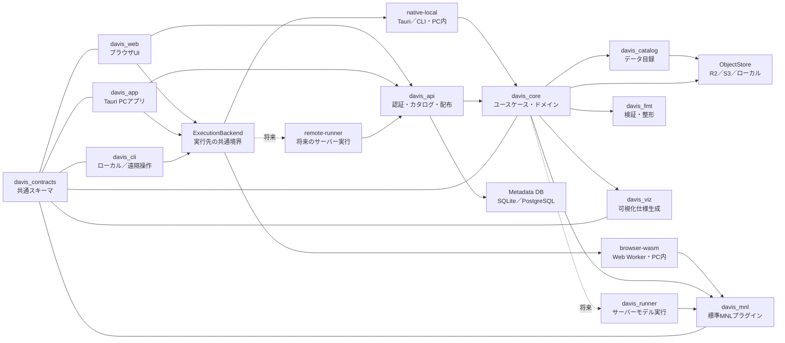

# Davis交通行動モデル統合プラットフォーム構想

> 状態: Draft 0.2
>
> 作成日: 2026-08-17
>
> 最終更新日: 2026-08-17
>
> 対象: Davisをデータ配布ツールから，交通行動モデルの準備・推定・理解を一体化したプラットフォームへ発展させる計画
>
> 原則: 未確定事項は推測で確定せず，本書内で「要確認」と明示する

## 1. エグゼクティブサマリー

Davisの目標を，次の1文に定めます．

> 学術的な行動モデルの知識や複雑な実行環境の構築なしに，利用者がデータを選び，整形し，モデルを指定し，推定結果を理解できるオープンな交通行動モデル基盤を提供する．

短期MVPでは，すべてを一度に作りません．参加者限定のWebアプリで，次の縦方向の一連の体験を最優先にします．

1. Webでデータカタログを閲覧する
2. データセットの説明と列定義を確認する
3. サンプルデータ，カタログから取得したデータ，またはPC上のファイルからMNLを設定する
4. データを外部サーバーへ送らず，PC内で推定ジョブを実行する
5. 係数，標準誤差，適合度，警告を表と基本グラフで確認する
6. 入力，モデル設定，推定結果を再現可能な成果物として取得する

推奨する技術の中心はRustです．`davis_core`，`davis_api`，`davis_mnl`，`davis_fmt`をRustで実装し，Web UIはTypeScript，PCアプリは同じWeb UIを再利用するTauriとします．MVPでは純粋な数値計算部分をRustからWebAssemblyへビルドし，Web Worker内でPC上の計算として実行します．大容量データ向けには同じ契約を使うネイティブローカル実行を追加し，将来はサーバー実行へ差し替えられる`ExecutionBackend`境界を設けます．可視化はVega-Liteを第一候補とし，PythonとMatplotlibを必須依存にしません．Pythonは既存モデルや研究者独自コードを接続するための任意アダプターとして残します．

ストレージはCloudflare R2を第一候補としながら，コード上ではS3互換APIやローカルファイルへ差し替え可能にします．カタログとデータ取得は当面参加者限定とし，将来はデータセット単位で一般公開，参加者限定，管理者限定を選べるようにします．DVCはサーバーや利用者の必須ランタイムから外し，既存データの移行，管理者向け同期，研究用再現パイプラインに限定して残す方針を推奨します．

## 2. 目標と成功条件

### 2.1. プロダクト目標

- 初学者が画面上の説明に従い，MNL推定を完了できる
- 研究者が同じ基盤へ独自モデル，整形処理，可視化を追加できる
- CLI，Web，PCアプリから同じ概念と同じ結果を利用できる
- データの意味，出典，ライセンス，列定義，バージョンを実データと一緒に配布できる
- すべての推定結果について，入力データの版，整形手順，モデル仕様，実装の版を追跡できる
- R2，S3，ローカルファイルなどの保存先を，ドメインロジックを書き換えずに変更できる

### 2.2. MVPの成功条件

- 代表的な1データセットをカタログ表示・ダウンロードできる
- CSVまたはParquetを読み込み，MNL用long形式として検証できる
- 選択肢，選択列，説明変数，基準選択肢をGUIから指定できる
- MNLの最尤推定が完了し，収束判定と基本統計量を返せる
- 同一入力と同一設定から同一結果を再実行できる
- エラー時に，初学者が次に直す箇所を日本語で理解できる
- Web UIとCLIが同じAPI契約および結果スキーマを利用する
- MNLの入力データと推定中間値が，既定では利用者PCの外へ送信されない
- 現在の`data/`配下にある全データセットがカタログへ掲載され，取得可否と利用可能な処理が分かる

### 2.3. 初期段階で対象外とするもの

- あらゆる離散選択モデルへの対応
- 大規模な分散計算基盤
- ノーコードでの任意モデル生成
- 高度なGIS編集機能
- リアルタイム交通シミュレーション
- 複数組織向けの複雑な権限管理
- 大容量データ向けPCアプリの正式配布
- すべての既存データを整形なしでMNLへ直接投入すること

## 3. 現状評価

現在の`packages/dataset_cli`は，次の資産をすでに持っています．

- データセット一覧，情報表示，ダウンロードのCLI
- PydanticによるデータセットYAMLとリリースマニフェストのスキーマ
- CSV，Excel，JSON，Parquetからのスキーマ推測
- 日本語・英語のメタデータ
- DVCとGoogle Driveによるデータ取得
- GitHub Releaseからのマニフェスト配布

一方，統合プラットフォームへ発展させる際には次の制約があります．

- CLIがDVC，Google Drive，PDF生成，UI表示，スキーマ処理を直接抱えている
- Python 3.13以上と多数の依存関係を利用者環境へ要求している
- カタログ，実データ取得，認証がGoogle Driveの構成へ結合している
- 既存列スキーマはデータ型の記述が中心で，行動モデル上の意味や整形履歴を表現できない
- 既存MNLは特定の入力ファイル構造とPythonコードに結合し，結果が機械可読な共通契約になっていない
- Web，デスクトップ，CLIで再利用できるアプリケーション境界がまだない

既存コードは破棄せず，MVPの移行元と回帰試験の基準として利用します．

### 3.1. 既存データの規模と扱い

2026-08-17時点の`data/`には，256個のDVC管理対象と177個の`*.schema.yaml`があります．DVCメタデータ上の合計サイズは約8.66 GiBで，最大の単一ファイルは約1.37 GiBです．数KBのコード表から1 GiBを超える位置情報CSVまで混在しています．

したがって，次を別の保証として扱います．

- **カタログ対応**: `data/`配下の全データを検索，説明，認可，ダウンロードの対象にする
- **形式対応**: CSV，Parquet，Excel，Shapefile，ZIPなど，ファイル形式ごとの閲覧・変換可否を示す
- **モデル対応**: MNLが要求する役割を満たす表だけを直接推定可能とし，不足時は必要な結合・変換を示す
- **実行Backend対応**: ファイルサイズと処理内容に応じて`browser-wasm`，`native-local`，将来の`remote-runner`の可否を示す

各データセット版には，次のような機械可読の能力情報をカタログ生成時に付与します．

```yaml
capabilities:
  catalog: ready
  download: ready
  browser_preview: limited
  format_recipes:
    - pt-to-mnl-long-v1
  model_inputs:
    mnl:
      status: requires_transform
      missing_roles: [alternative_id, available]
execution_hints:
  largest_file_bytes: 1473891953
  recommended_backend: native-local
```

`ready`，`requires_transform`，`unsupported`を画面で明示し，「一覧にあるため直接MNLへ使える」という誤解を防ぎます．

## 4. 設計原則

1. **契約を先に作る**: UIやストレージ実装より先に，データ，モデル要求，結果，ジョブのスキーマを定義します．
2. **ドメインと配信方法を分ける**: `davis_core`はHTTP，R2，画面表示を知りません．
3. **ライブラリAPIとHTTP APIを対応させる**: ローカルCLIとサーバーの挙動差を最小化します．
4. **データは自己記述的にする**: 実データ，`dataset.yaml`，チェックサム，ライセンスを同じリリース単位で扱います．
5. **不変な版を参照する**: `latest`を保存せず，データ版と内容ハッシュを推定記録へ固定します．
6. **推定と可視化を分ける**: 推定器は構造化結果を返し，可視化側はその結果から表示を構成します．
7. **拡張は言語ABIではなくデータ契約で行う**: 独自モデルをRustの動的ライブラリABIへ固定しません．
8. **初学者向け説明と研究者向け詳細を両立する**: 画面には平易な説明を出し，詳細ログと数値は失わないようにします．
9. **秘密情報をクライアントへ配らない**: ストレージ資格情報はサーバー側だけに置き，短時間の署名付きURLを発行します．
10. **Pythonは任意にする**: 標準経路はPythonなしで動作し，必要な研究コードだけを隔離されたランナーで実行します．

## 5. 推奨アーキテクチャ

### 5.1. 全体像



MVPの`davis_web`で利用者がPC上のファイルを選ぶ操作は，サーバーへのアップロードを意味しません．ブラウザのFile APIで読み，Web Worker内のWASM推定器へ渡します．推定要求と結果は共通契約を使いますが，生データは既定でPC外へ出しません．

推定実行先は次の3種類を同じ`ExecutionBackend`として扱います．

| Backend | 実行場所 | 主用途 | 時期 |
| --- | --- | --- | --- |
| `browser-wasm` | ブラウザのWeb Worker | インストール不要の小〜中規模推定 | P0 |
| `native-local` | TauriまたはCLIのRustプロセス | 大容量データ，オフライン，WASM非対応処理 | P1 |
| `remote-runner` | 管理されたサーバーワーカー | 長時間計算，共有実験，低性能PC支援 | 将来 |

UIは`ExecutionBackend`の能力情報を読み，入力サイズや必要機能に応じて利用可能な実行先だけを表示します．利用者の明示的な同意なしに，ローカル入力を`remote-runner`へ送信しません．

### 5.2. コンポーネント責務

| コンポーネント | 責務 | 単独利用 | MVP |
| --- | --- | --- | --- |
| `davis_contracts` | JSON Schema，Rust型，OpenAPIの共通契約 | 可 | P0 |
| `davis_core` | カタログ取得，データ取得，整形，推定，成果物管理のユースケース | 可 | P0 |
| `davis_api` | HTTP，参加者認証，カタログ，署名付きURL，将来の遠隔ジョブ | サービスとして可 | P0は配布機能 |
| `davis_catalog` | `dataset.yaml`の検証，索引，検索，版管理 | 可 | P0 |
| `davis_mnl` | 一般的なMNL仕様の検証，推定，予測，共通結果の出力 | native／WASM | P0 |
| `davis_web` | データ閲覧，ローカルファイル選択，モデル設定，PC内推定，結果表示 | Webとして可 | P0 |
| `davis_fmt` | 生データの読込，標準化，欠損処理，変換レシピ | 可 | P1の最小部のみP0 |
| `davis_viz` | 共通結果からVega-Lite仕様と表を生成 | 可 | P1の最小部のみP0 |
| `davis_cli` | 上記ユースケースの薄いCLIクライアント | 可 | P1．既存CLIは当面維持 |
| `davis_app` | Web UIを再利用し，大容量データをネイティブ実行するTauriアプリ | 可 | P1 |
| `davis_runner` | 将来のサーバー上でモデルを安全に実行し，進捗と取消を扱う | 可 | P2 |

### 5.3. `davis_core`の位置付け

`davis_core`を「ストレージそのもの」にすると，R2やDVCの都合が全機能へ波及します．そのため，`davis_core`はアプリケーションの根幹となるドメインとユースケースを持ち，ストレージは次のような抽象インターフェースとして扱う設計を推奨します．

```rust
#[async_trait]
pub trait ArtifactStore {
    async fn get(&self, key: &ArtifactKey) -> Result<ByteStream, StoreError>;
    async fn put(&self, request: PutArtifact) -> Result<ArtifactRef, StoreError>;
    async fn stat(&self, key: &ArtifactKey) -> Result<ArtifactMeta, StoreError>;
    async fn signed_get_url(&self, key: &ArtifactKey, ttl: Duration)
        -> Result<Url, StoreError>;
}
```

R2，S3，ローカルファイルはこのインターフェースのアダプターです．カタログ検索用のメタデータはオブジェクトストレージの一覧走査に頼らず，SQLiteまたはPostgreSQLの読み取りモデルへ索引化します．

## 6. 共通契約

### 6.1. 契約の配布

- HTTP API: OpenAPI 3.1
- 永続化・プラグイン契約: JSON Schema
- 表データの保存: Parquet
- 高速なプロセス間転送: Arrow IPC
- 人が編集する設定: YAML
- Web表示用の小さな応答: JSON
- 大きなファイル: APIを経由せず，短時間の署名付きURLで直接転送

YAMLとJSONを別々の仕様にしません．JSON Schemaを規範とし，YAMLはその表現形式として検証します．Rust型から生成する場合も，CIで生成差分を検出して契約変更をレビューします．

### 6.2. バージョニング

- HTTPは`/api/v1`のようにメジャーバージョンをURLへ含める
- 各スキーマは`schema_version: 1`を持つ
- 後方互換なフィールド追加は同一メジャー版で許可する
- 既存フィールドの意味変更，削除，型変更は次のメジャー版で行う
- データセット版はSemVerを強制せず，発行者が付けた不変の`version`と`sha256`で特定する
- 推定結果は使用した全入力の内容ハッシュと実装版を記録する

### 6.3. 共通エラー

すべての入口で次の構造を返します．HTTPではRFC 9457形式のProblem Detailsへ対応させます．

```json
{
  "type": "https://davis.example/errors/invalid-choice-column",
  "title": "選択結果の列を利用できません",
  "status": 422,
  "code": "DAVIS-MNL-1003",
  "detail": "choice列には各case_id内で1つだけtrueが必要です",
  "instance": "/api/v1/jobs/job_01...",
  "issues": [
    {"row": 18, "column": "choice", "hint": "case_id=trip-7を確認してください"}
  ]
}
```

`code`は安定させ，`detail`は日本語と英語へローカライズできるようにします．

### 6.4. 非同期ジョブ

データ整形や推定は，短い処理でも最初からジョブとして表現します．MVPのジョブはブラウザ内で生成し，Web Workerで実行します．将来サーバーへ移しても，契約は次の状態機械を守ります．

```text
queued -> running -> succeeded
                  -> failed
                  -> cancelling -> cancelled
```

ジョブには`progress`，`stage`，`warnings`，`created_at`，`started_at`，`finished_at`，`result_ref`，`execution_backend`を持たせます．ローカルジョブの履歴と結果はIndexedDBまたはOrigin Private File Systemへ保存し，利用者が明示的にエクスポートできます．これにより，将来のネイティブ実行やサーバーワーカーへ移行できます．

### 6.5. 実行Backend契約

Web UIはWASMを直接呼ばず，次の概念インターフェースを介します．TypeScriptとRustで同じ要求・応答スキーマを利用します．

```typescript
interface ExecutionBackend {
  capabilities(): Promise<ExecutionCapabilities>;
  validate(request: EstimateRequest): Promise<ValidationResult>;
  estimate(request: EstimateRequest): Promise<JobHandle>;
  getJob(jobId: string): Promise<Job>;
  cancel(jobId: string): Promise<void>;
  exportRun(runId: string): Promise<Blob>;
}
```

`EstimateRequest`は入力表の参照，モデル仕様，実行制限を持ちます．参照の種類は`browser_file`，`local_artifact`，`remote_artifact`とし，Backendが扱えない参照は推定開始前に拒否します．この境界により，UIを書き換えずに`browser-wasm`から`native-local`，さらに`remote-runner`へ追加できます．

## 7. データカタログと保存方式

### 7.1. 推奨オブジェクト構造

```text
datasets/
  jp-pt-tokyo/
    2008-r1/
      dataset.yaml
      files/
        trips.parquet
        zones.parquet
      docs/
        README.ja.md
        README.en.md
      checksums.sha256
catalog/
  v1/
    index.json
artifacts/
  sha256/
    ab/cd/<full-digest>
runs/
  <run-id>/
    request.json
    result.json
    diagnostics.json
    charts.json
```

公開済みの`datasets/<id>/<version>/`は上書き禁止とします．修正時は新しい版を発行します．`artifacts/sha256/`は重複排除と再現性のための内容アドレス領域です．

### 7.2. `dataset.yaml`の役割

既存の列名と型に加えて，モデルや整形が理解できる意味情報を持たせます．ただし，すべてのデータに一つの物理列名を強制しません．元の列名を保存しつつ，`semantic_role`と変換レシピで共通概念へ対応付けます．

```yaml
schema_version: 1
id: jp-pt-tokyo
version: 2008-r1
title:
  ja: 東京都市圏PT調査
  en: Tokyo Metropolitan Area Person Trip Survey
description:
  ja: 東京都市圏のパーソントリップ調査データ
  en: Person trip survey data for the Tokyo metropolitan area
license:
  id: LicenseRef-Proprietary
  text:
    ja: 利用条件をここに記載
    en: Usage terms go here
access:
  level: cohort
  cohort_ids: [summer-school-2026]
provenance:
  publisher: example-publisher
  source_url: https://example.invalid/source
  issued_at: 2026-08-17
tables:
  - id: trips
    path: files/trips.parquet
    media_type: application/vnd.apache.parquet
    sha256: "<64桁のハッシュ>"
    row_count: 1000
    columns:
      - name: TripID
        data_type: int64
        nullable: false
        semantic_role: trip.id
      - name: Transportation
        data_type: int64
        nullable: false
        semantic_role: choice.mode
        code_list:
          "1": rail
          "2": bus
```

必要項目を増やし過ぎると登録が止まるため，必須項目は`id`，`version`，表示名，ライセンス，アクセス区分，ファイルのパス・型・ハッシュに絞ります．列説明や意味役割は段階的に充実させます．

### 7.3. YAMLの正本と公開

MVPでは，レビュー可能な`catalog/datasets/<id>/<version>/dataset.yaml`をGit上の正本とします．公開ジョブが検証後に実データと同じR2プレフィックスへ同一内容を配置し，`catalog/v1/index.json`を再生成します．Webは高速な`index.json`またはAPIを読み，詳細画面では`dataset.yaml`相当の情報を表示します．

将来，管理画面から登録できるようにする場合も，サーバーがデータとYAMLを一つの発行トランザクションとして扱い，Gitへのエクスポートまたは監査ログを残します．

### 7.4. R2とDVCの判断

| 選択肢 | 利点 | 課題 | 推奨用途 |
| --- | --- | --- | --- |
| R2をアプリから直接利用 | S3互換，署名付きURL，Web配信に適する，クライアントにDVC不要 | カタログと版管理はDavis側で設計が必要 | 本番ランタイムの第一候補 |
| R2をDVCリモートとして利用 | 既存DVC運用を移行しやすい，研究者のGit連携を維持 | Python／DVC依存，Web配信APIとしては扱いにくい | 管理者同期と移行 |
| Google Drive＋DVCを維持 | 現行資産をそのまま利用可能 | 利用者ごとのOAuth設定，アプリ境界への強い結合 | 移行期間のみ |
| S3／MinIO | 標準性が高く，オンプレミスも可能 | 運用費と構築作業が増える場合がある | 組織要件に応じた代替 |

結論として，DVCを全面廃止する必要はありませんが，Davisの公開APIと利用者体験の必須要素にはしません．DVCのS3互換エンドポイント設定を利用すればR2を管理用リモートとして検証できます．一方，WebとPCアプリのダウンロードは`davis_api`が発行する署名付きURLを使います．

### 7.5. 参加者限定アクセスと将来拡張

MVPではCloudflare AccessをWebと`davis_api`の前段に置き，参加者メールアドレスのallowlistとメールによるOne-time PINを第一候補とします．独自のパスワード保存や認証画面を急造しません．`davis_api`はAccessが付与する認証情報を検証し，監査記録では安定した利用者IDへ対応付けます．

認可はCloudflare固有のルールをドメインへ直接持ち込まず，次のアクセス区分として`dataset.yaml`へ記録します．

| `access.level` | 意味 |
| --- | --- |
| `public` | 認証なしで取得可能 |
| `authenticated` | Davisへログインした利用者が取得可能 |
| `cohort` | 指定された年度・講義・参加者群だけが取得可能 |
| `admin` | 管理者だけが取得可能 |

MVPは`cohort`を既定にします．将来の一般公開ではデータセット単位で`public`へ変更でき，大学のOIDC，Google，GitHub等のIdPへ認証方式を交換しても，この認可モデルとAPI応答を維持します．署名付きダウンロードURLは認可後に短い有効期限で発行します．

## 8. `davis_fmt`の設計

### 8.1. 「一般データ入力」の定義

一般入力を特定のDataFrameライブラリのオブジェクトにしません．境界では次を標準とします．

- 保存と交換: Parquet＋Arrowスキーマ
- 少量の利用者入力: CSV，XLSX，JSONを受け付け，直ちに内部Parquetへ正規化
- ネイティブ実行時: RustのArrow／Polars表現
- ブラウザ実行時: Web Worker内でストリーミング読込し，推定に必要な数値行列だけを保持
- 外部プラグイン: Parquetファイル参照またはArrow IPCストリーム

これにより，Pythonのpandas，R，Julia，Goなども同じデータへ接続できます．Apache Arrowは言語非依存の列指向フォーマットであるため，特定言語のDataFrame APIを共通契約にするより安定します．

ブラウザWASMへPolars全体をそのまま持ち込むことはP0の前提にしません．`davis_mnl_kernel`はデータ読込から分離し，必要な列を数値配列として受け取ります．ブラウザ側はCSVとParquetの最小ローダー，ネイティブ側はArrow／Polarsアダプターを使います．実行可能な上限は固定値を推測せず，ブラウザ，利用可能メモリ，推定時の展開量を事前診断して決めます．上限を超える場合はダウンロードまたは`native-local`利用を案内します．

### 8.2. 変換レシピ

整形はコードだけでなく，機械可読かつ再実行可能なレシピとして保存します．

```yaml
schema_version: 1
input_table: raw_trips
output_table: mnl_long
steps:
  - op: rename
    columns:
      TripID: case_id
      Transportation: chosen_mode
  - op: map_values
    column: chosen_mode
    values:
      "1": rail
      "2": bus
  - op: cast
    column: travel_time
    to: float64
  - op: filter
    expression: travel_time >= 0
```

初期対応する演算は，列名変更，型変換，値対応，列選択，欠損除外，単純な式による列生成，wide／long変換に限定します．任意コード実行はP0へ含めません．

### 8.3. 列名の標準化

「一般的な名称」には唯一の世界標準がないため，物理列名を一括変更する設計は避けます．次の3層で管理します．

1. `source_name`: 元データの列名
2. `canonical_name`: 当該レシピ内の安定した英語snake_case名
3. `semantic_role`: `trip.id`，`choice.selected`，`level_of_service.travel_time`などの意味識別子

これにより，データ提供者の原本を壊さず，モデルごとに必要な役割を検証できます．

## 9. `davis_mnl`の設計

### 9.1. 入力形式

標準MNLはlong形式を規範入力とします．1行は「1ケースにおける1選択肢」を表します．最低限，次の役割が必要です．

| 役割 | 説明 | 例 |
| --- | --- | --- |
| `case_id` | 意思決定機会の識別子 | trip_001 |
| `alternative_id` | 選択肢 | rail |
| `choice` | 実際に選ばれたか | true |
| `available` | 選択可能か | true |
| 説明変数 | 時間，費用，個人属性など | 32.5 |

各`case_id`で`choice=true`がちょうど1件であること，選択された選択肢が利用可能であること，必要変数が数値であることを推定前に検証します．wide形式は`davis_fmt`が明示的なレシピでlong形式へ変換します．

### 9.2. モデル仕様

モデルの内部コードを書き換えなくても，一般的な効用関数を設定できる宣言形式を先に提供します．高度な研究モデルだけをプラグインとして追加します．

```yaml
schema_version: 1
model_type: mnl
data:
  table: mnl_long
  case_id: case_id
  alternative_id: alternative_id
  choice: choice
  availability: available
reference_alternative: walk
utilities:
  rail: asc_rail + beta_time * travel_time + beta_cost * cost
  bus: asc_bus + beta_time * travel_time + beta_cost * cost
  walk: beta_time * travel_time
parameters:
  - name: asc_rail
    initial: 0.0
  - name: asc_bus
    initial: 0.0
  - name: beta_time
    initial: -0.1
  - name: beta_cost
    initial: -0.01
optimizer:
  method: lbfgs
  max_iterations: 500
  tolerance: 1.0e-8
```

式言語は四則演算，括弧，列参照，パラメーター参照から開始し，任意関数や任意コードは許可しません．式を構文木へ変換してデザイン行列を構築すれば，GUIの式ビルダーとテキスト編集の両方を提供できます．

### 9.3. 共通推定結果

`davis_mnl`はHTMLや画像ではなく，次の共通構造を返します．

```json
{
  "schema_version": 1,
  "run_id": "run_01...",
  "model": {"id": "davis.mnl", "version": "0.1.0"},
  "status": "converged",
  "parameters": [
    {
      "name": "beta_time",
      "estimate": -0.083,
      "std_error": 0.012,
      "z_value": -6.92,
      "p_value": 4.5e-12,
      "confidence_interval_95": [-0.107, -0.060]
    }
  ],
  "fit": {
    "n_cases": 1000,
    "n_observations": 3000,
    "log_likelihood": -721.4,
    "null_log_likelihood": -1098.6,
    "rho_squared": 0.343,
    "adjusted_rho_squared": 0.339,
    "aic": 1450.8,
    "bic": 1470.4
  },
  "diagnostics": {
    "iterations": 28,
    "gradient_norm": 2.1e-7,
    "hessian_condition": 184.2,
    "warnings": []
  },
  "provenance": {
    "dataset_sha256": "<hash>",
    "model_spec_sha256": "<hash>",
    "software_revision": "<git-sha>"
  }
}
```

数値は形式例であり，実データの結果ではありません．推定器を書き換えてもこの共通部分を返せば，`davis_viz`はそのモデルを表示できます．モデル固有情報は`extensions`名前空間へ追加します．

### 9.4. 統計的な最低品質

P0であっても，係数だけを出して完了とはしません．最低限，次を実装・検証します．

- log-sum-expによる数値安定化
- 解析勾配または自動微分と有限差分による照合
- 収束判定と未収束警告
- Hessianまたは情報行列からの分散共分散
- 標準誤差，z値，p値，95%信頼区間
- 対数尤度，null対数尤度，McFaddenのρ²，補正ρ²，AIC，BIC
- 完全共線性，識別不能，利用不能な選択肢，欠損，オーバーフローの診断
- 小さな既知データと既存実装との数値比較

ロバスト標準誤差，クラスタリング，重み付き尤度，パネル構造はP1以降に分離します．

### 9.5. ローカル実行可能な実装分割

`davis_mnl`を次の2層へ分けます．

- `davis_mnl_kernel`: ファイル，HTTP，OSを知らず，数値配列と`MnlSpec`から`EstimateResult`を返す．nativeとWASMの両方へビルドする
- `davis_mnl_io`: CSV／Parquet読込，列役割の解決，カテゴリ展開，結果保存を担当する．ブラウザ用とネイティブ用のアダプターを持つ

WASM版はUIスレッドを止めないようWeb Worker内で実行し，進捗イベントと取消フラグを返します．同じkernelのnative試験とWASM試験へ共通fixtureを通し，実行場所による数値差を許容誤差内に収めます．将来の`remote-runner`もこのnative版を呼ぶため，推定数式と結果契約を複製しません．

## 10. モデル差し替えとプラグイン境界

Rustの`trait`は同一ビルド内の拡張には有効ですが，第三者が別バージョンでビルドした動的ライブラリの安定ABIとしては使いません．拡張レベルを次の3段階にします．

1. **モデル設定**: 標準MNLのYAML式を変更する．大半の利用者はここで完結する
2. **同一ワークスペース実装**: Rustの`ModelEngine` traitを実装してDavis本体と一緒にビルドする
3. **外部プラグイン**: 実行可能ファイルまたはOCIコンテナが，バージョン付きJSON＋Parquet契約で入出力する

外部プラグインの例です．

```yaml
schema_version: 1
id: example.nested-logit
version: 0.1.0
protocol: davis-model-runner-v1
command: ["./davis-nl-plugin"]
capabilities:
  model_types: ["nested_logit"]
  operations: ["validate", "estimate", "predict"]
input_contract: davis://schemas/estimate-request/1
output_contract: davis://schemas/estimate-result/1
```

MVPでは標準MNLをプロセス内実行し，契約だけを外部実行可能な形にします．外部プロセス，OCI，WASIの実行はP1以降です．第三者コードをサーバー上で動かす際は，CPU，メモリ，時間，ネットワーク，ファイルアクセスを制限します．

## 11. `davis_viz`の設計

`davis_viz`はモデルの生データ構造を直接読まず，共通`EstimateResult`と追加の`PredictionResult`を読みます．出力は次の組合せです．

- 表示用ViewModel
- Vega-Lite JSON仕様
- CSV／JSONの表
- 必要に応じてSVG／PNGへ変換するエクスポート処理

P0の画面は次に限定します．

- 係数，標準誤差，p値，信頼区間の表
- 係数と95%信頼区間のフォレストプロット
- 適合度と収束状態のカード
- 推定警告と，平易な説明

P1では予測シェア，弾力性，限界効果，観測対予測，シナリオ比較を追加します．Vega-Liteは宣言的なJSON仕様でWebへ埋め込めるため，共通結果から図を生成する境界に適しています．Matplotlibは論文用図や既存研究コード向けの任意エクスポーターとして追加可能です．

## 12. WebとPCアプリ

### 12.1. `davis_web`

推奨構成はTypeScript＋React系フレームワークです．MVPではフレームワーク固有のサーバー機能へビジネスロジックを置きません．カタログと認可は`davis_api`を呼び，整形・MNL・可視化は`ExecutionBackend`を通じてPC内で実行します．OpenAPIとJSON SchemaからTypeScript型を生成します．

初学者向けの主要画面は次のとおりです．

1. データカタログ
2. データセット詳細とライセンス確認
3. データ取得またはPC上のファイル選択，プレビュー，品質チェック
4. 「何を選んだか」「選択肢は何か」から始まるモデル設定ウィザード
5. 推定前チェックと推定実行
6. 結果の要約，詳細，警告，ダウンロード

専門用語はツールチップだけに隠さず，「この数値から何が分かるか」と「何は断定できないか」を結果画面へ表示します．

ブラウザ版のデータ処理は次の原則に従います．

- ファイル選択はサーバー送信ではなく，ローカル読込として明示する
- 推定はWeb Workerで実行し，画面操作を停止させない
- 入力サイズ，行数，必要メモリを推定前に診断する
- 入力と結果は既定でブラウザ内だけに保持する
- 永続化または共有は利用者が明示的にエクスポートした場合だけ行う
- ブラウザ処理に適さないデータには`native-local`を案内する

### 12.2. `davis_app`

Tauriを利用し，`davis_web`のUIコンポーネントとAPIクライアントを再利用します．オンライン時は参加者認証とカタログ取得のため`davis_api`へ接続し，データ整形と推定は同梱したRustの`davis_core`でPC内実行します．許可済みデータを保存している場合は，オフラインでもローカルファイルの整形・推定・可視化を利用できます．

PCアプリはP1とします．MVPではブラウザWASMで縦の体験を完成させ，既存の数百MB〜1 GiB超のファイルを扱う段階でTauriの`native-local`を追加します．TauriはRust側とWebView側をメッセージングで接続できるため，Web完成後の再利用に向いています．

### 12.3. `davis_cli`

既存CLIは急いで全面移植せず，互換期間を設けます．新CLIは薄いクライアントとし，次の2モードを同じコマンド体系で提供します．

```text
davis catalog list
davis dataset get jp-pt-tokyo@2008-r1
davis fmt apply recipe.yaml --input raw.csv --output clean.parquet
davis mnl fit model.yaml --data clean.parquet --output run/
davis --server https://davis.example ...
```

- ローカルモード: `davis_core`を直接呼ぶ
- サーバーモード: `davis_api`を呼ぶ

## 13. HTTP APIの初期案

P0で実装するサーバーAPIです．推定データは受け取りません．

```text
GET    /api/v1/health
GET    /api/v1/me
GET    /api/v1/datasets
GET    /api/v1/datasets/{dataset_id}/versions/{version}
POST   /api/v1/datasets/{dataset_id}/versions/{version}/download-url
```

将来のサーバー実行で追加するAPIです．P0のWeb UIは同じジョブ契約をブラウザ内で実装します．

```text
POST   /api/v1/uploads
POST   /api/v1/uploads/{upload_id}/parts
POST   /api/v1/uploads/{upload_id}/complete
POST   /api/v1/format/validate
POST   /api/v1/format/jobs
POST   /api/v1/models/mnl/validate
POST   /api/v1/estimate/jobs
GET    /api/v1/jobs/{job_id}
POST   /api/v1/jobs/{job_id}/cancel
GET    /api/v1/runs/{run_id}
GET    /api/v1/runs/{run_id}/result
GET    /api/v1/runs/{run_id}/visualizations
```

将来の`POST /estimate/jobs`はファイル本体を受け取らず，明示的にアップロードを完了した不変な`artifact_ref`と`model_spec`を受け取ります．同じ内容ハッシュと設定ハッシュの組合せは，再利用可能な結果としてキャッシュできます．ローカル入力を利用者の同意なく自動アップロードしません．

## 14. 推奨技術スタック

| 領域 | 第一候補 | 理由 | 代替 |
| --- | --- | --- | --- |
| Core／API／MNL／fmt | Rust | 単一バイナリ，型安全，Pythonランタイム不要，Polars／Arrow利用 | GoはAPI開発が速いが，表処理と数値計算を別実装にしやすい |
| HTTP | Axum系 | Tokioと統合しやすく，Rustの標準的構成 | Actix Web |
| 表処理 | Arrow＋Polars Rust | CSV／Parquet処理と列演算をRustで統一 | DataFusionを大規模SQL時に追加 |
| 数値計算 | nalgebraまたはndarray＋十分に検証した最適化器 | MNLの行列演算と最適化をPythonなしで実行 | 初期検証だけPython参照実装と比較 |
| Web | TypeScript＋React系 | UI資産，OpenAPI型生成，Vega-Lite連携 | Svelte系 |
| ブラウザ内推定 | Rust→WebAssembly＋Web Worker | PC内実行，UI停止の回避，nativeとkernel共有 | TypeScript数値実装は二重実装になるため避ける |
| 可視化 | Vega-Lite | JSON契約，Web向け，宣言的 | Plotly.js，Observable Plot |
| PC | Tauri | Web UI再利用，Rust統合，OSのWebView利用 | Electron |
| オブジェクト保存 | R2＋Rust `object_store`抽象 | S3互換，ローカル／他クラウドへ差し替え可能 | S3，MinIO，GCS |
| 参加者認証 | Cloudflare Access＋メールOTP | 参加者allowlistを短期構築し，後でIdP交換可能 | 大学OIDC，Google OIDC |
| メタデータ | SQLiteから開始，PostgreSQLへ移行可能 | 数日MVPで運用が軽い | 初期からPostgreSQL |
| API契約 | OpenAPI 3.1＋JSON Schema | 言語横断の生成と検証 | Protobufは内部ワーカー分離時に再検討 |

Rust採用のリスクは，チームの学習コストと統計ライブラリの選定です．そのため，MNL数式の単体試験とPython等の参照実装との数値一致試験を重視します．参照実装は検証だけに使い，標準ランタイムへPythonを要求しません．WASM化が数日以内に安定しない場合は，API契約を変えず，Rustの`native-local`をCLIまたは最小Tauri shellから呼ぶ経路を先に提供します．

## 15. リポジトリ構成案

Rustではパッケージ名を`davis-core`，コード内crate名を`davis_core`とする慣例に合わせます．

```text
davis/
  Cargo.toml
  crates/
    davis-contracts/
    davis-core/
    davis-catalog/
    davis-api/
    davis-fmt/
    davis-mnl/
    davis-mnl-kernel/
    davis-viz/
    davis-runner/
    davis-cli/
  apps/
    web/
    desktop/
  web-packages/
    ui/                # WebとTauriで共有するUI
    web-runtime-wasm/  # Web WorkerとWASMの接続
  catalog/
    datasets/
  schemas/
    v1/
  examples/
    mnl-basic/
  packages/
    dataset_cli/       # 移行期間中の既存Python CLI
  legacy/
    models/            # 移行完了後に既存モデルを移す候補
  docs/
    adr/
    davis-platform-concept.md
```

MVP開始時に既存`src/`や`packages/dataset_cli`を移動しません．新基盤が同等機能を持ち，移行試験が通った段階で別PRとして整理します．

## 16. 実装優先順位と数日MVP

### P0: 3〜5日で縦に通す

#### Day 0: 安全確保と実装準備

- 現在平文保存されているGoogle OAuthクライアントシークレットを失効・再発行する
- Cloudflare Accessへ登録する参加者メール一覧の管理方法を決める
- 既存データのライセンスと参加者向け再配布可否を棚卸しする
- Rust，TypeScript，R2の開発資格情報を準備する

#### Day 1: 契約と骨格

- Cargo workspaceを作る
- `davis_contracts`へDataset，ArtifactRef，MnlSpec，EstimateResult，Job，ExecutionBackendを定義する
- JSON SchemaとOpenAPIの生成または固定スキーマを用意する
- `ArtifactStore`のローカル実装とR2実装を作る
- 既存DVCメタデータと177個の列スキーマから新カタログを自動生成する変換器を作る

#### Day 2: MNLの最短経路

- `davis_mnl_kernel`をファイル処理から独立させる
- CSV／Parquet読込とlong形式検証の最小経路を実装する
- 効用式の最小パーサーまたは構造化式を実装する
- MNL尤度，勾配，最適化，共通結果を実装する
- 合成データと参照実装による数値試験を作る
- nativeとWASMの両方で共通fixtureを実行する

#### Day 3: ブラウザ内推定

- Web Workerと`browser-wasm`の`ExecutionBackend`を作る
- WebにPC上のファイル選択，プレビュー，MNL設定フォーム，結果表を作る
- 入力サイズと必要メモリの事前診断を作る
- 基本的なVega-Liteグラフを1つ表示する

#### Day 4: 参加者限定カタログ

- Cloudflare AccessのメールOTPとallowlistを設定する
- データセット一覧・詳細・署名付きダウンロードURLのAPIを作る
- 既存`data/`の全項目をカタログへ掲載する
- 各項目へファイル形式，サイズ，MNL readiness，推奨Backendを表示する
- R2への移行状況を`available`，`migrating`，`legacy-only`で表示する

#### Day 5: 品質と公開準備

- 入力エラーと未収束の説明を整える
- 代表的な既存データまたはそこから作る再配布可能fixtureでE2E試験を1本作る
- 監査用provenanceと成果物ダウンロードを完成させる
- R2上のサンプルデータでステージング動作を確認する
- 利用手順と開発者向け拡張手順を記載する

P0で削ってよいものは高度なデザイン，大容量向けPCアプリ，任意プラグイン実行，サーバー推定です．削ってはいけないものはPC内実行，入力検証，収束表示，結果契約，ハッシュ，ライセンス表示，参加者認証，秘密情報の分離です．全データのR2転送が完了しなくても全件をカタログへ載せ，移行状態を隠しません．

### P1: MVP後の1〜3週間

- `davis_fmt`の変換レシピとwide／long変換
- Tauri PCアプリと`native-local` Backend
- 予測，弾力性，限界効果，可視化
- CLIのRust移植と既存コマンド互換
- ロバスト標準誤差，重み，パネル対応
- 管理者向けデータ登録・検証・公開コマンド
- 日本語／英語UIとアクセシビリティ
- 既存全データのR2移行と形式別プレビューの拡充

### P2: 1〜3か月

- Nested Logit，Mixed Logitなどの追加モデル
- OCI／WASIモデルプラグイン
- 外部モデルランナーのv1プロトコル
- `remote-runner`，PostgreSQL，永続ジョブキュー
- シナリオ比較と実験管理
- 組織，プロジェクト，権限，利用規約同意の管理
- 大規模ワーカー，計算資源制限，利用量管理
- 外部データカタログやGISとの連携

## 17. セキュリティとデータガバナンス

現状の`.dvc/config.local`にはGoogle OAuthクライアントシークレットが平文で存在します．Git管理外であっても，漏えい可能性を考慮して失効・再発行を推奨します．新基盤では次を必須とします．

- 秘密情報は環境変数またはデプロイ先のSecret Managerへ保存する
- Web，CLI，PCアプリへR2の永続資格情報を配布しない
- Cloudflare Accessの通過だけに依存せず，`davis_api`でも認証トークンとデータアクセス区分を検証する
- 非公開ファイルは短時間の署名付きURLで取得する
- 署名付きURLをBearer tokenとして扱い，ログへ完全なURLを出さない
- アップロードファイルのサイズ，形式，拡張子だけでなく内容を検証する
- 元データ，整形データ，推定成果物ごとにアクセス区分と保持期限を持つ
- 個人情報を含むデータについて，ログ，プレビュー，エラーへの値の露出を防ぐ
- ブラウザ内推定の入力と結果をテレメトリ，クラッシュレポート，解析SDKへ送らない
- サーバー実行を将来追加する場合は，送信対象，保存期間，削除方法を実行前に明示して同意を得る
- ライセンス同意が必要なデータは，同意記録とダウンロード監査を残す
- 外部モデルはサンドボックス化するまで一般利用者に実行させない

## 18. 試験戦略

### 契約試験

- JSON Schemaのvalid／invalid fixture
- Rust型，OpenAPI，TypeScript生成型の整合
- 古いマイナー版の入力を新実装が読めること

### 数値試験

- 手計算可能な小規模2項／多項Logit
- 合成データで真値付近へ回復すること
- 既存Python実装または信頼できる参照実装との尤度・係数比較
- 極端な効用値でNaNやoverflowが発生しないこと
- 共線性，選択肢欠落，完全分離，未収束を正しく警告すること
- native版とWASM版が許容誤差内で同じ結果を返すこと

### 統合試験

- ローカルArtifactStoreとR2互換テスト環境で同じ契約試験を実行
- データ公開からカタログ反映，ダウンロードまで
- PC上のファイル選択，ブラウザ内整形，推定，結果表示，成果物エクスポートまで
- 認証されていない利用者や対象cohort外の利用者が署名付きURLを取得できないこと

### UI試験

- 初学者がサンプルデータから説明なしで完了できるユーザビリティ試験
- キーボード操作，色だけに依存しない警告，日本語の長文表示
- 大容量入力時にブラウザが停止せず，`native-local`案内へ安全に移れること

## 19. 主要リスクと対策

| リスク | 影響 | 対策 |
| --- | --- | --- |
| 数日で範囲を広げ過ぎる | どの機能も完成しない | 全件をカタログ化しつつ，E2Eは1データ，1モデル，1グラフの縦切りに固定 |
| 共通化を急ぎ過ぎる | 抽象だけが増える | 2つ目の実装が必要になるまで抽象を最小限にする |
| Rust統計実装の誤り | 推定結果への信頼を失う | 参照実装比較，有限差分照合，既知fixture |
| 列名標準化で原情報を失う | 再現不能になる | source／canonical／semanticの3層を保持 |
| YAMLとDBが不一致になる | 説明と実体がずれる | 公開パイプラインだけが索引を生成し，ハッシュで検証 |
| 任意コード実行 | 情報漏えい，サービス停止 | P0では禁止し，後に隔離ランナーを導入 |
| R2固有機能への結合 | 保存先変更が困難 | `ArtifactStore`とS3互換APIを境界にする |
| ブラウザで大容量データを開く | メモリ不足，画面停止 | 事前診断，Web Worker，ストリーミング，`native-local`への切替 |
| ローカルとサーバーで結果がずれる | 再現性を失う | 同一kernel，同一契約，共通fixture，実装版の記録 |
| 既存データをすべてMNL対応と誤認する | 不正な分析につながる | データごとにreadinessと不足する意味役割を表示 |
| 初学者向け簡略化で誤解を招く | 不適切な解釈 | 前提，警告，診断を隠さず平易に説明 |

## 20. 先に作るADR

実装開始時に次のArchitecture Decision Recordを短く作成します．

1. ADR-0001: Rustを標準バックエンド言語とするか
2. ADR-0002: 共通表形式をParquet＋Arrowとするか
3. ADR-0003: R2を第一ストレージとし，DVCを管理用途へ限定するか
4. ADR-0004: MNLの規範入力をlong形式とするか
5. ADR-0005: 可視化契約をVega-Lite JSONとするか
6. ADR-0006: MVPを参加者限定`cohort`とし，認証をCloudflare Accessで実装するか
7. ADR-0007: 推定を`ExecutionBackend`で抽象化し，P0を`browser-wasm`とするか
8. ADR-0008: 既存全データのカタログ掲載とMNL readiness表示を分離するか

## 21. 確認済み事項と残る確認事項

### 21.1. 確認済み事項

1. **利用者と公開範囲**: 当面は参加者限定とし，将来ほかの利用者群や一般公開へ拡張可能にする
2. **MVPの操作範囲**: Webでデータ選択／ローカルファイル選択，MNL設定，推定，結果表示まで含める
3. **実行場所**: 当面は利用者PC内で実行し，将来サーバー実行を追加可能にする
4. **データ範囲**: 現在の`data/`にある全データをカタログの対象とし，個別に選択・利用できる基盤にする

4の「利用できる」は，すべてのファイルを無変換でMNLへ投入できるという意味にはしません．全件をカタログ，認可，取得の対象とし，データごとに直接推定可能か，整形が必要か，対象外かを明示します．

### 21.2. 残る確認事項

以下は設計上の事実が不足しているため，まだ確定していません．実装の該当箇所へ着手する前に確認します．

1. **期待利用規模**: 同時利用者数と，許容される初回ダウンロード時間
2. **MNL要件**: 代替固有変数，個人固有変数，availability，標本重み，パネル，ロバスト標準誤差のうちP0必須のもの
3. **運用環境**: Cloudflare中心に寄せるか，既存の大学サーバーや別クラウドも使うか
4. **開発体制**: Rust，TypeScript，統計実装を担当する人数と経験
5. **ライセンス**: Davis本体の公開ライセンスと，各既存データの利用条件
6. **参加者管理**: メールアドレスを誰が，どこで，どの頻度で更新するか

## 22. 直近の着手順

確認済み事項を反映し，次の順で開始できます．

1. ADR-0006〜0008を作り，今回の決定を固定する
2. 256個のDVCメタデータと177個の列スキーマを読み，新カタログへ変換する棚卸しツールを作る
3. 既存MNLの入出力と数値挙動を回帰fixtureへ固定する
4. `davis_mnl_kernel`のnative／WASM両対応を小さなlong形式fixtureで検証する
5. `davis_contracts`の最小スキーマと`ExecutionBackend`を作る
6. Web Worker上でファイル選択から結果表示まで縦に通す
7. Cloudflare Access，カタログAPI，R2署名付きダウンロードを接続する
8. 既存データを段階的にR2へ移し，カタログ上の移行状態を更新する

## 23. 参考資料

- [Cloudflare R2の仕組み](https://developers.cloudflare.com/r2/how-r2-works/)
- [Cloudflare R2のS3 API](https://developers.cloudflare.com/r2/api/s3/)
- [Cloudflare R2の署名付きURL](https://developers.cloudflare.com/r2/api/s3/presigned-urls/)
- [Cloudflare AccessのメールOne-time PIN](https://developers.cloudflare.com/cloudflare-one/integrations/identity-providers/one-time-pin/)
- [Cloudflare Access Policies](https://developers.cloudflare.com/cloudflare-one/access-controls/policies/)
- [DVCのS3およびS3互換ストレージ設定](https://doc.dvc.org/user-guide/data-management/remote-storage/amazon-s3)
- [Apache Arrow Columnar Format](https://arrow.apache.org/docs/format/Columnar.html)
- [Polars User Guide](https://docs.pola.rs/user-guide/getting-started/)
- [Vega-Lite Documentation](https://vega.github.io/vega-lite/docs/)
- [Tauri Architecture](https://tauri.app/concept/architecture/)
