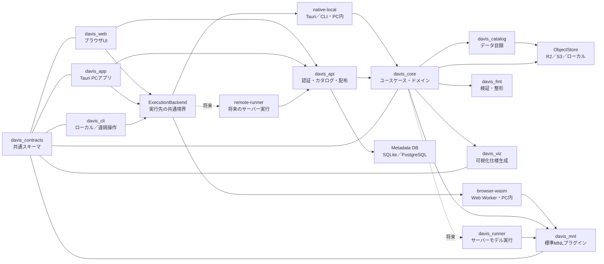

# Davis 交通行動モデル統合プラットフォーム構想

> 状態: Draft 0.3
>
> 作成日: 2026-08-17
>
> 最終更新日: 2026-08-17
>
> 対象: Davisをデータ配布ツールから，交通行動モデルの準備・推定・理解を一体化したプラットフォームへ発展させる計画
>
> 原則: 未確定事項を推測で補わず，本書内で「要確認」と明示する

## 1. エグゼクティブサマリー

Davisの目標を，次の1文に定めます．

> 行動モデルに関する専門知識や複雑な実行環境の構築を必要とせず，利用者がデータを選び，整形し，モデルを指定し，推定結果を理解できる拡張可能な交通行動モデル基盤を提供する．

短期MVPでは，すべてを一度に作りません．参加者限定のWebアプリで，次の一連の操作を最初から最後まで行えることを優先します．

1. Webでデータカタログを閲覧する
2. データセットの説明と列定義を確認する
3. サンプルデータ，カタログから取得したデータ，またはPC上のファイルを使ってMNLを設定する
4. データを外部サーバーへ送らず，PC内で推定ジョブを実行する
5. 係数，標準誤差，適合度，警告を表と基本グラフで確認する
6. 入力データ，モデル設定，推定結果を，再現可能な一式として保存する

中核技術にはRustを推奨します．`davis_core`，`davis_api`，`davis_mnl`，`davis_fmt`をRustで実装します．Web UIにはTypeScriptを使い，PCアプリには同じWeb UIを再利用できるTauriを採用します．

MVPでは数値計算部分をRustからWebAssemblyへビルドし，PC上のWeb Worker内で実行します．大容量データ向けには，同じ契約に従うネイティブ実行を追加します．さらに，`ExecutionBackend`を介して実行方式を切り替えられるようにし，将来のサーバー実行にも備えます．

可視化にはVega-Liteを第一候補とし，PythonとMatplotlibを必須依存にしません．Pythonは，既存モデルや研究者独自のコードを接続する場合に限り，任意のアダプターとして利用します．

ストレージの第一候補はCloudflare R2としますが，S3互換ストレージやローカルファイルへ差し替えられる設計にします．カタログの閲覧とデータの取得は当面参加者に限定し，将来はデータセットごとに一般公開，参加者限定，管理者限定を選べるようにします．DVCはサーバーや利用者の必須ランタイムから外し，既存データの移行，管理者向けの同期，研究用の再現パイプラインに用途を限定して残す方針です．

ただし，利用者向けの処理からDVCを外すのは，現行`davis-cli`で取得できるすべてのファイルをR2経由でも取得でき，ハッシュが一致することを確認した後に限ります．一部の代表データが取得できるだけでは，MVPの完了とはみなしません．

## 2. 目標と成功条件

### 2.1. プロダクト目標

- 初学者が画面上の説明に従い，MNL推定を完了できる
- 研究者が同じ基盤へ独自モデル，整形処理，可視化を追加できる
- CLI，Web，PCアプリのどれを使っても，同じ考え方で操作でき，同じ形式の結果を得られる
- データの意味，出典，ライセンス，列定義，バージョンを実データと一緒に配布できる
- すべての推定結果について，入力データの版，整形手順，モデル仕様，実装の版を追跡できる
- R2，S3，ローカルファイルなどの保存先を，ドメインロジックを書き換えずに変更できる

### 2.2. MVPの成功条件

- 現行`davis-cli`で取得できるすべてのデータセットと関連文書を，新しいカタログ／ダウンロード経路からも取得できる
- CSVまたはParquetを読み込み，MNL向けのlong形式として検証できる
- 選択肢，選択列，説明変数，基準選択肢をGUIから指定できる
- MNLの最尤推定が完了し，収束判定と基本統計量を返せる
- 同一入力と同一設定から同一結果を再実行できる
- エラーが発生したときに，初学者でも修正すべき箇所を日本語で理解できる
- Web UIとCLIが同じAPI契約および結果スキーマを利用する
- MNLの入力データと推定中間値が，既定では利用者PCの外へ送信されない
- 現在の`data/`配下にある全データセットがカタログに掲載され，ダウンロードの可否と利用できる処理を確認できる
- 既存の`davis list`，`davis info`，`davis get`の利用者向け機能を，移行完了まで維持する

### 2.3. 初期段階で対象外とするもの

- あらゆる離散選択モデルへの対応
- 大規模な分散計算基盤
- ノーコードでの任意モデル生成
- 高度なGIS編集機能
- リアルタイム交通シミュレーション
- 複数組織向けの複雑な権限管理
- 大容量データ向けPCアプリの正式配布
- すべての既存データを整形なしでMNLへ直接投入すること

## 3. 現状評価

現在の`packages/dataset_cli`には，次の機能と資産があります．

- データセット一覧，情報表示，ダウンロードのCLI
- PydanticによるデータセットYAMLとリリースマニフェストのスキーマ
- CSV，Excel，JSON，Parquetからのスキーマ推測
- 日本語・英語のメタデータ
- DVCとGoogle Driveによるデータ取得
- GitHub Releaseからのマニフェスト配布

一方，統合プラットフォームへ発展させるには，次の課題があります．

- CLIがDVC，Google Drive，PDF生成，画面表示，スキーマ処理を直接抱えている
- Python 3.13以上と多数の依存関係を利用者環境へ要求している
- カタログ，実データの取得，認証がGoogle Driveの構成に強く依存している
- 既存列スキーマはデータ型の記述が中心で，行動モデル上の意味や整形履歴を表現できない
- 既存MNLは特定の入力ファイル構造とPythonコードに依存しており，推定結果にも共通の機械可読形式がない
- Web，PCアプリ，CLIで処理を共有するための共通インターフェースがない

既存コードは破棄せず，MVPの移行元と回帰試験の基準として利用します．

### 3.1. 既存データの規模と扱い

2026-08-17時点の`data/`には，256個のDVC管理対象と177個の`*.schema.yaml`があります．DVCメタデータ上の合計サイズは約8.66 GiBで，最大の単一ファイルは約1.37 GiBです．数KBのコード表から1 GiBを超える位置情報CSVまで混在しています．

データによって形式や用途が大きく異なるため，対応範囲を次の4つに分けて示します．

- **カタログ対応**: `data/`配下の全データを検索，説明，認可，ダウンロードの対象にする
- **形式対応**: CSV，Parquet，Excel，Shapefile，ZIPなど，ファイル形式ごとの閲覧・変換可否を示す
- **モデル対応**: MNLに必要な列と意味を備えた表だけを直接推定できるようにし，不足している場合は必要な結合や変換を示す
- **実行方式対応**: ファイルサイズと処理内容に応じて，`browser-wasm`，`native-local`，将来の`remote-runner`のどれを利用できるか示す

カタログを生成するときに，各データセットの版へ次のような機械可読の対応状況を付与します．

```yaml
capabilities:
  catalog: ready
  download: ready
  browser_preview: limited
  format_recipes:
    - pt-to-mnl-long-v1
  model_inputs:
    mnl:
      status: requires_transform
      missing_roles: [alternative_id, available]
execution_hints:
  largest_file_bytes: 1473891953
  recommended_backend: native-local
```

画面には`ready`，`requires_transform`，`unsupported`を明示し，カタログに掲載されているだけでMNLへ直接使えるという誤解を防ぎます．

## 4. 設計原則

1. **契約を先に作る**: UIやストレージを実装する前に，データ，モデルへの要求，推定結果，ジョブのスキーマを定義します．
2. **ドメインと配信方法を分ける**: `davis_core`をHTTP，R2，画面表示の都合に依存させません．
3. **ライブラリAPIとHTTP APIを対応させる**: ローカルCLIとサーバーで挙動が大きく変わらないようにします．
4. **データは自己記述的にする**: 実データ，`dataset.yaml`，チェックサム，ライセンスを同じリリース単位で扱います．
5. **公開済みの版を変更しない**: `latest`だけに依存せず，推定に使ったデータの版と内容ハッシュを記録します．
6. **推定と可視化を分ける**: 推定器は構造化結果を返し，可視化側はその結果から表示を構成します．
7. **拡張は言語ABIではなくデータ契約で行う**: 独自モデルをRustの動的ライブラリABIへ固定しません．
8. **初学者向けの説明と研究者向けの詳細を両立する**: 画面には平易な説明を示しながら，詳細なログや数値も確認できるようにします．
9. **秘密情報をクライアントへ配らない**: ストレージ資格情報はサーバー側だけに置き，短時間の署名付きURLを発行します．
10. **Pythonは任意にする**: 標準経路はPythonなしで動作し，必要な研究コードだけを隔離されたランナーで実行します．

## 5. 推奨アーキテクチャ

### 5.1. 全体像



MVPの`davis_web`でPC上のファイルを選んでも，そのファイルはサーバーへアップロードされません．ブラウザのFile APIで読み込み，Web Worker内のWASM推定器へ渡します．推定要求と結果には共通のデータ形式を使いますが，生データは既定でPCの外へ出しません．

推定の実行方式は，次の3種類です．いずれも共通の`ExecutionBackend`として扱います．

| 実行方式 | 実行場所 | 主な用途 | 時期 |
| --- | --- | --- | --- |
| `browser-wasm` | ブラウザのWeb Worker | インストール不要で行う小〜中規模の推定 | P0 |
| `native-local` | TauriまたはCLIのRustプロセス | 大容量データ，オフライン，WASM非対応処理 | P1 |
| `remote-runner` | 管理されたサーバーワーカー | 長時間計算，共有実験，低性能PC支援 | 将来 |

UIは`ExecutionBackend`の対応機能を確認し，入力サイズや必要な機能に適した実行方式だけを表示します．利用者の明示的な同意なしに，PC上の入力データを`remote-runner`へ送信しません．

### 5.2. コンポーネント責務

| コンポーネント | 責務 | 単独利用 | MVP |
| --- | --- | --- | --- |
| `davis_contracts` | JSON Schema，Rust型，OpenAPIの共通契約 | 可 | P0 |
| `davis_core` | カタログ取得，データ取得，整形，推定，成果物管理のユースケース | 可 | P0 |
| `davis_api` | HTTP，参加者認証，カタログ，署名付きURL，将来のサーバージョブ | サービスとして可 | P0では配布機能のみ |
| `davis_catalog` | `dataset.yaml`の検証，索引，検索，版管理 | 可 | P0 |
| `davis_mnl` | 一般的なMNL仕様の検証，推定，予測，共通結果の出力 | ネイティブ／WASM | P0 |
| `davis_web` | データ閲覧，ローカルファイル選択，モデル設定，PC内推定，結果表示 | Webとして可 | P0 |
| `davis_fmt` | 生データの読み込み，標準化，欠損処理，変換レシピ | 可 | 最小機能をP0，残りをP1 |
| `davis_viz` | 共通の推定結果からVega-Lite仕様と表を生成 | 可 | 最小機能をP0，残りをP1 |
| `davis_cli` | 上記機能を呼び出す軽量なCLIクライアント | 可 | P1．既存CLIは当面維持 |
| `davis_app` | Web UIを再利用し，大容量データをネイティブ実行するTauriアプリ | 可 | P1 |
| `davis_runner` | 将来のサーバー上でモデルを安全に実行し，進捗と取消を扱う | 可 | P2 |

### 5.3. `davis_core`の位置付け

`davis_core`にストレージの具体的な処理まで持たせると，R2やDVCの変更が全機能へ影響します．そこで，`davis_core`にはアプリケーションの中心となる概念と処理を置き，ストレージは次のような抽象インターフェースを介して利用します．

```rust
#[async_trait]
pub trait ArtifactStore {
    async fn get(&self, key: &ArtifactKey) -> Result<ByteStream, StoreError>;
    async fn put(&self, request: PutArtifact) -> Result<ArtifactRef, StoreError>;
    async fn stat(&self, key: &ArtifactKey) -> Result<ArtifactMeta, StoreError>;
    async fn signed_get_url(&self, key: &ArtifactKey, ttl: Duration)
        -> Result<Url, StoreError>;
}
```

R2，S3，ローカルファイルごとに，このインターフェースの実装を用意します．カタログ検索用のメタデータは，オブジェクトストレージを毎回走査せず，SQLiteまたはPostgreSQLへ索引化して参照します．

## 6. 共通契約

### 6.1. 契約の配布

- HTTP API: OpenAPI 3.1
- 永続化・プラグイン契約: JSON Schema
- 表データの保存: Parquet
- 高速なプロセス間転送: Arrow IPC
- 人が編集する設定ファイル: YAML
- Web表示用の小規模な応答: JSON
- 大容量ファイル: APIサーバーを経由せず，有効期間の短い署名付きURLで直接転送

YAMLとJSONに別々の仕様を設けません．JSON Schemaを正式な仕様とし，YAMLも同じスキーマで検証します．Rustの型定義からスキーマを生成する場合も，CIで差分を検出し，仕様変更としてレビューします．

### 6.2. バージョニング

- HTTPは`/api/v1`のようにメジャーバージョンをURLへ含める
- 各スキーマは`schema_version: 1`を持つ
- 後方互換なフィールド追加は同一メジャー版で許可する
- 既存フィールドの意味変更，削除，型変更は次のメジャー版で行う
- データセットにはSemVerを強制せず，発行者が付けた変更不能な`version`と`sha256`で版を特定する
- 推定結果は使用した全入力の内容ハッシュと実装版を記録する

### 6.3. 共通エラー

すべてのAPIで，エラーを次の形式に統一します．HTTPではRFC 9457のProblem Detailsに対応させます．

```json
{
  "type": "https://davis.example/errors/invalid-choice-column",
  "title": "選択結果の列を利用できません",
  "status": 422,
  "code": "DAVIS-MNL-1003",
  "detail": "choice列には各case_id内で1つだけtrueが必要です",
  "instance": "/api/v1/jobs/job_01...",
  "issues": [
    {"row": 18, "column": "choice", "hint": "case_id=trip-7を確認してください"}
  ]
}
```

`code`は版が変わっても可能な限り維持し，`detail`は日本語と英語で表示できるようにします．

### 6.4. 非同期ジョブ

データ整形や推定は，処理時間の長短にかかわらずジョブとして扱います．MVPではブラウザ内でジョブを作成し，Web Workerで実行します．将来サーバー実行へ移行しても，次の状態遷移を維持します．

```text
queued -> running -> succeeded
                  -> failed
                  -> cancelling -> cancelled
```

ジョブには`progress`，`stage`，`warnings`，`created_at`，`started_at`，`finished_at`，`result_ref`，`execution_backend`を持たせます．PC内で実行したジョブの履歴と結果は，IndexedDBまたはOrigin Private File Systemへ保存し，利用者がファイルとして書き出せるようにします．同じ形式を使うことで，将来のネイティブ実行やサーバーワーカーにも対応できます．

### 6.5. 実行バックエンドの共通契約

Web UIからWASMを直接呼ばず，次の共通インターフェースを介して実行します．要求と応答には，TypeScriptとRustで同じスキーマを使います．

```typescript
interface ExecutionBackend {
  capabilities(): Promise<ExecutionCapabilities>;
  validate(request: EstimateRequest): Promise<ValidationResult>;
  estimate(request: EstimateRequest): Promise<JobHandle>;
  getJob(jobId: string): Promise<Job>;
  cancel(jobId: string): Promise<void>;
  exportRun(runId: string): Promise<Blob>;
}
```

`EstimateRequest`には，入力表の参照，モデル仕様，実行上の制限を含めます．参照の種類は`browser_file`，`local_artifact`，`remote_artifact`とし，選択したバックエンドで扱えない参照は推定開始前にエラーとします．このインターフェースに従うことで，UIを書き換えずに`native-local`や`remote-runner`を追加できます．

## 7. データカタログと保存方式

### 7.1. 推奨オブジェクト構造

```text
datasets/
  jp-pt-tokyo/
    2008-r1/
      dataset.yaml
      files/
        trips.parquet
        zones.parquet
      docs/
        README.ja.md
        README.en.md
      checksums.sha256
catalog/
  v1/
    index.json
artifacts/
  sha256/
    ab/cd/<full-digest>
runs/
  <run-id>/
    request.json
    result.json
    diagnostics.json
    charts.json
```

公開済みの`datasets/<id>/<version>/`は上書きしません．修正が必要な場合は，新しい版を発行します．`artifacts/sha256/`には内容のハッシュをキーとしてファイルを保存し，重複を避けながら再現性を確保します．

### 7.2. `dataset.yaml`の役割

既存の列名と型に加えて，モデルや整形処理が列の意味を判断するための情報を持たせます．ただし，すべてのデータに同じ列名を強制しません．元の列名を保存したまま，`semantic_role`と変換レシピを使って共通の概念に対応付けます．

```yaml
schema_version: 1
id: jp-pt-tokyo
version: 2008-r1
title:
  ja: 東京都市圏PT調査
  en: Tokyo Metropolitan Area Person Trip Survey
description:
  ja: 東京都市圏のパーソントリップ調査データ
  en: Person trip survey data for the Tokyo metropolitan area
license:
  id: LicenseRef-Proprietary
  text:
    ja: 利用条件をここに記載
    en: Usage terms go here
access:
  level: cohort
  cohort_ids: [summer-school-2026]
provenance:
  publisher: example-publisher
  source_url: https://example.invalid/source
  issued_at: 2026-08-17
tables:
  - id: trips
    path: files/trips.parquet
    media_type: application/vnd.apache.parquet
    sha256: "<64桁のハッシュ>"
    row_count: 1000
    columns:
      - name: TripID
        data_type: int64
        nullable: false
        semantic_role: trip.id
      - name: Transportation
        data_type: int64
        nullable: false
        semantic_role: choice.mode
        code_list:
          "1": rail
          "2": bus
```

必須項目が多過ぎるとデータ登録の負担が増えるため，`id`，`version`，表示名，ライセンス，アクセス区分，ファイルのパス・型・ハッシュに絞ります．列の説明や意味上の役割は，段階的に追加します．

### 7.3. YAMLの原本と公開

MVPでは，Git上の`catalog/datasets/<id>/<version>/dataset.yaml`を正式な原本とし，変更内容をレビューできるようにします．公開処理では，検証済みのYAMLを実データと同じR2のパスへ配置し，`catalog/v1/index.json`を再生成します．Webは検索用の`index.json`またはAPIを読み込み，詳細画面に`dataset.yaml`の内容を表示します．

将来，管理画面からデータを登録できるようにする場合も，データとYAMLを一つの公開処理として扱います．さらに，Gitへ書き出すか監査ログを残し，変更履歴を追跡できるようにします．

### 7.4. R2とDVCの判断

| 選択肢 | 利点 | 課題 | 推奨用途 |
| --- | --- | --- | --- |
| R2をアプリから直接利用 | S3互換，署名付きURL，Web配信に適する，利用者側にDVCが不要 | カタログと版管理はDavis側で設計が必要 | 本番環境の第一候補 |
| R2をDVCリモートとして利用 | 既存DVC運用を移行しやすい，研究者のGit連携を維持 | Python／DVC依存，Web配信APIとしては扱いにくい | 管理者同期と移行 |
| Google Drive＋DVCを維持 | 現行資産をそのまま利用可能 | 利用者ごとのOAuth設定が必要で，アプリがGoogle Driveへ強く依存する | 移行期間のみ |
| S3／MinIO | 標準性が高く，オンプレミスも可能 | 運用費と構築作業が増える場合がある | 組織要件に応じた代替 |

DVCを全面的に廃止する必要はありませんが，Davisの公開APIや利用者向けアプリの必須要素にはしません．DVCからS3互換エンドポイントを指定すれば，R2を管理者向けのリモートストレージとして利用できます．一方，WebとPCアプリからのダウンロードには，`davis_api`が発行する署名付きURLを使います．

### 7.5. `davis-cli`ダウンロード互換性

MVPでは，現行`davis-cli`から取得できるデータを一つも欠落させないことをリリース条件とします．現在のマニフェストに記載されているデータセットID，階層指定，DVCファイル，関連文書を，互換性を判断する基準として記録します．

移行は次の順序で行います．

1. 現行マニフェストから，すべてのダウンロード対象とそのサイズ・ハッシュをまとめた基準一覧を生成する
2. すべての対象をR2へコピーし，新しい`dataset.yaml`とカタログ索引へ対応付ける
3. 参加者権限で新APIを利用し，すべての対象についてダウンロード計画を生成できることを検証する
4. リリース前の監査で全ファイルを新しい経路から取得し，サイズとSHA-256を基準一覧と照合する
5. 監査が1件でも失敗した場合はMVPをリリースせず，現行`davis-cli`とGoogle Drive／DVC経路を維持する

開発中は`migrating`や`legacy-only`を表示しても構いませんが，MVPのリリース時には，現行の取得対象をすべて新しい経路からダウンロードできる状態にします．新CLIを公開する場合は，少なくとも次の互換試験を行います．

```text
davis list
davis info <すべての既存DATASET_ID>
davis get <すべての既存DATASET_ID>
davis get <既存のディレクトリ指定>
```

コマンドの表示文言や内部実装を完全に一致させる必要はありません．ただし，取得できるデータと関連文書，出力先の指定，ファイルの整合性検証は，現行CLIと同等以上にします．

### 7.6. 参加者限定アクセスと将来拡張

MVPではCloudflare AccessをWebと`davis_api`の手前に置き，参加者メールアドレスの許可リストと，メールで送信するワンタイムPINを第一候補とします．独自のパスワード管理や認証画面は実装しません．`davis_api`でもAccessが付与した認証情報を検証し，監査記録には利用者を一意に識別できるIDを保存します．

アクセス権はCloudflare固有のルールと切り離し，次の区分として`dataset.yaml`へ記録します．

| `access.level` | 意味 |
| --- | --- |
| `public` | 認証なしで取得可能 |
| `authenticated` | Davisへログインした利用者が取得可能 |
| `cohort` | 指定された年度・講義・参加者群だけが取得可能 |
| `admin` | 管理者だけが取得可能 |

MVPでは`cohort`を既定値にします．将来，一般公開するデータセットは`public`へ変更できます．また，認証方式を大学のOIDC，Google，GitHub等のIdPへ変更しても，このアクセス区分とAPIの応答形式は維持します．署名付きダウンロードURLは，アクセス権を確認した後に，短い有効期間を設定して発行します．

## 8. `davis_fmt`の設計

### 8.1. 「一般データ入力」の定義

共通の入力形式を，特定のDataFrameライブラリに依存させません．データの受け渡しには，次の形式を使います．

- 保存と交換: Parquet＋Arrowスキーマ
- 小規模な利用者入力: CSV，XLSX，JSONを受け付け，内部処理用のParquetへ変換
- ネイティブ実行時: RustのArrow／Polars表現
- ブラウザ実行時: Web Worker内でストリーミング読込し，推定に必要な数値行列だけを保持
- 外部プラグイン: Parquetファイル参照またはArrow IPCストリーム

この構成なら，Pythonのpandas，R，Julia，Goなどからも同じデータを扱えます．Apache Arrowは言語に依存しない列指向フォーマットであり，特定言語のDataFrame APIを共通仕様にするよりも長期的に安定します．

P0では，Polars全体をブラウザWASMへ組み込むことを前提にしません．`davis_mnl_kernel`をデータの読み込み処理から分離し，推定に必要な列だけを数値配列として渡します．ブラウザ側にはCSVとParquetの読み込みに必要な機能だけを実装し，ネイティブ側ではArrow／Polarsアダプターを使います．

ブラウザで処理できる上限は推測で決めず，利用可能なメモリと，推定時に必要となるメモリ量から事前に判定します．上限を超える場合は，ファイルのダウンロードまたは`native-local`の利用を案内します．

### 8.2. 変換レシピ

整形はコードだけでなく，機械可読かつ再実行可能なレシピとして保存します．

```yaml
schema_version: 1
input_table: raw_trips
output_table: mnl_long
steps:
  - op: rename
    columns:
      TripID: case_id
      Transportation: chosen_mode
  - op: map_values
    column: chosen_mode
    values:
      "1": rail
      "2": bus
  - op: cast
    column: travel_time
    to: float64
  - op: filter
    expression: travel_time >= 0
```

初期段階では，列名の変更，型変換，値の対応付け，列選択，欠損値の除外，単純な式による列生成，wide形式とlong形式の変換に対応します．任意のコードを実行する機能はP0に含めません．

### 8.3. 列名の標準化

列の「一般的な名称」には広く合意された唯一の標準がないため，元データの列名を一律に変更することは避けます．列名と意味を次の3層で管理します．

1. `source_name`: 元データの列名
2. `canonical_name`: 当該レシピ内の安定した英語snake_case名
3. `semantic_role`: `trip.id`，`choice.selected`，`level_of_service.travel_time`などの意味識別子

これにより，データ提供者の原本を保ったまま，モデルごとに必要な列がそろっているか検証できます．

## 9. `davis_mnl`の設計

### 9.1. 入力形式

標準MNLでは，long形式を正式な入力形式とします．1行は，ある意思決定機会における一つの選択肢を表します．最低限，次の列が必要です．

| 役割 | 説明 | 例 |
| --- | --- | --- |
| `case_id` | 意思決定機会の識別子 | trip_001 |
| `alternative_id` | 選択肢 | rail |
| `choice` | 実際に選ばれたか | true |
| `available` | 選択可能か | true |
| 説明変数 | 時間，費用，個人属性など | 32.5 |

推定前に，各`case_id`で`choice=true`がちょうど1件であること，選ばれた選択肢が利用可能であること，必要な変数が数値であることを検証します．wide形式のデータは，`davis_fmt`が明示的な変換レシピに従ってlong形式へ変換します．

### 9.2. モデル仕様

モデルの内部コードを書き換えなくても一般的な効用関数を設定できるように，宣言的なモデル仕様を用意します．この仕様で表現できない高度な研究モデルは，プラグインとして追加します．

```yaml
schema_version: 1
model_type: mnl
data:
  table: mnl_long
  case_id: case_id
  alternative_id: alternative_id
  choice: choice
  availability: available
reference_alternative: walk
utilities:
  rail: asc_rail + beta_time * travel_time + beta_cost * cost
  bus: asc_bus + beta_time * travel_time + beta_cost * cost
  walk: beta_time * travel_time
parameters:
  - name: asc_rail
    initial: 0.0
  - name: asc_bus
    initial: 0.0
  - name: beta_time
    initial: -0.1
  - name: beta_cost
    initial: -0.01
optimizer:
  method: lbfgs
  max_iterations: 500
  tolerance: 1.0e-8
```

数式では，まず四則演算，括弧，列参照，パラメーター参照だけを使えるようにします．任意の関数やコードは実行できないようにします．数式を構文木へ変換してデザイン行列を作ることで，GUIによる数式作成とテキスト編集の両方に対応できます．

### 9.3. 共通推定結果

`davis_mnl`はHTMLや画像ではなく，次の共通構造を返します．

```json
{
  "schema_version": 1,
  "run_id": "run_01...",
  "model": {"id": "davis.mnl", "version": "0.1.0"},
  "status": "converged",
  "parameters": [
    {
      "name": "beta_time",
      "estimate": -0.083,
      "std_error": 0.012,
      "z_value": -6.92,
      "p_value": 4.5e-12,
      "confidence_interval_95": [-0.107, -0.060]
    }
  ],
  "fit": {
    "n_cases": 1000,
    "n_observations": 3000,
    "log_likelihood": -721.4,
    "null_log_likelihood": -1098.6,
    "rho_squared": 0.343,
    "adjusted_rho_squared": 0.339,
    "aic": 1450.8,
    "bic": 1470.4
  },
  "diagnostics": {
    "iterations": 28,
    "gradient_norm": 2.1e-7,
    "hessian_condition": 184.2,
    "warnings": []
  },
  "provenance": {
    "dataset_sha256": "<hash>",
    "model_spec_sha256": "<hash>",
    "software_revision": "<git-sha>"
  }
}
```

数値は形式を示すための例であり，実データの推定結果ではありません．推定器を書き換えた場合も，この共通部分を返せば，`davis_viz`で結果を表示できます．モデル固有の情報は`extensions`名前空間へ追加します．

### 9.4. 統計面の最低要件

P0であっても，係数を出力するだけでは不十分です．最低限，次の項目を実装し，正しく計算できることを検証します．

- log-sum-expによる数値安定化
- 解析勾配または自動微分と有限差分による照合
- 収束判定と未収束警告
- Hessianまたは情報行列からの分散共分散
- 標準誤差，z値，p値，95%信頼区間
- 対数尤度，null対数尤度，McFaddenのρ²，補正ρ²，AIC，BIC
- 完全共線性，識別不能，利用不能な選択肢，欠損，オーバーフローの診断
- 正解が分かっている小規模データと既存実装を使った数値比較

ロバスト標準誤差，クラスタリング，重み付き尤度，パネル構造への対応はP1以降に追加します．

### 9.5. PC内実行に対応するための実装分割

`davis_mnl`を次の2層へ分けます．

- `davis_mnl_kernel`: ファイル形式，HTTP，OSに依存せず，数値配列と`MnlSpec`から`EstimateResult`を生成する．ネイティブ版とWASM版の両方をビルドする
- `davis_mnl_io`: CSV／Parquet読込，列役割の解決，カテゴリ展開，結果保存を担当する．ブラウザ用とネイティブ用のアダプターを持つ

WASM版は，画面の操作を妨げないようにWeb Worker内で実行し，進捗と取消状態を返します．ネイティブ版とWASM版には同じテストデータを使い，実行方式による数値差が許容誤差内に収まることを確認します．将来の`remote-runner`も同じネイティブ版を呼び出し，推定式や結果形式の重複実装を避けます．

## 10. モデル差し替えとプラグイン境界

Rustの`trait`は同じビルド内で機能を拡張する場合には有効です．一方，第三者が別のバージョンでビルドした動的ライブラリとの安定したABIには使いません．モデルの拡張方法を次の3段階に分けます．

1. **モデル設定**: 標準MNLのYAML式を変更する．一般的なモデル変更はこの方法で対応する
2. **同一ワークスペース実装**: Rustの`ModelEngine` traitを実装してDavis本体と一緒にビルドする
3. **外部プラグイン**: 実行可能ファイルまたはOCIコンテナが，バージョン付きJSON＋Parquet契約で入出力する

外部プラグインの例です．

```yaml
schema_version: 1
id: example.nested-logit
version: 0.1.0
protocol: davis-model-runner-v1
command: ["./davis-nl-plugin"]
capabilities:
  model_types: ["nested_logit"]
  operations: ["validate", "estimate", "predict"]
input_contract: davis://schemas/estimate-request/1
output_contract: davis://schemas/estimate-result/1
```

MVPでは，標準MNLをDavisの組み込み機能として実行します．ただし，入出力の形式は，将来外部プラグインからも利用できるように設計します．外部プロセス，OCI，WASIによる実行はP2以降に追加します．第三者のコードをサーバー上で動かす場合は，CPU，メモリ，実行時間，ネットワーク，ファイルアクセスを制限します．

## 11. `davis_viz`の設計

`davis_viz`はモデル固有の内部データを直接読みません．共通形式である`EstimateResult`と，必要に応じて`PredictionResult`を受け取り，次の形式で出力します．

- 画面表示用のViewModel
- Vega-Lite JSON仕様
- CSV／JSONの表
- 必要に応じてSVG／PNGとして書き出す処理

P0の画面は次に限定します．

- 係数，標準誤差，p値，信頼区間の表
- 係数と95%信頼区間のフォレストプロット
- 適合度と収束状態の要約
- 推定時の警告と平易な説明

P1では予測シェア，弾力性，限界効果，観測値と予測値の比較，シナリオ比較を追加します．Vega-LiteはJSONでグラフを定義でき，Webへ組み込みやすいため，共通の推定結果からグラフを生成する用途に適しています．Matplotlibは，論文用の図や既存研究コード向けの任意出力機能として追加できます．

## 12. WebとPCアプリ

### 12.1. `davis_web`

TypeScriptとReact系フレームワークの採用を推奨します．MVPでは，フレームワーク固有のサーバー機能に中核の処理を置きません．カタログの取得とアクセス権の確認には`davis_api`を使い，整形，MNL推定，可視化は`ExecutionBackend`を通じてPC内で実行します．

TypeScriptの型はOpenAPIとJSON Schemaから生成します．

初学者向けの主要画面は次のとおりです．

1. データカタログ
2. データセット詳細とライセンス確認
3. データ取得またはPC上のファイル選択，プレビュー，品質チェック
4. 「実際に選ばれたものは何か」「選択肢には何があるか」から始めるモデル設定ウィザード
5. 推定前チェックと推定実行
6. 結果の要約，詳細，警告，ダウンロード

専門用語の説明をツールチップだけで済ませず，「この数値から分かること」と「この数値だけでは断定できないこと」を結果画面に表示します．

ブラウザ版のデータ処理は次の原則に従います．

- ファイルを選択してもサーバーへ送信されず，PC内で読み込まれることを明示する
- 推定はWeb Workerで実行し，処理中も画面を操作できるようにする
- 入力サイズ，行数，必要メモリを推定前に診断する
- 入力データと推定結果は，既定ではブラウザ内だけに保持する
- 保存や共有は，利用者が明示的にファイルを書き出した場合に限る
- ブラウザ処理に適さないデータには`native-local`を案内する

### 12.2. `davis_app`

Tauriを利用し，`davis_web`のUIコンポーネントとAPIクライアントを再利用します．オンライン時は，参加者認証とカタログ取得のために`davis_api`へ接続します．データの整形と推定には，同梱したRustの`davis_core`を使い，PC内で実行します．利用条件の範囲内でPCへ保存したデータについては，オフラインでも整形，推定，可視化を行えます．

PCアプリはP1で実装します．MVPでは，ブラウザWASMを使ってデータ選択から結果表示までの一連の操作を完成させます．既存の数百MBから1 GiBを超えるファイルを処理する段階で，Tauriによる`native-local`を追加します．TauriはRust側とWebView側をメッセージで接続できるため，完成したWeb UIを再利用できます．

### 12.3. `davis_cli`

既存CLIを直ちに全面移植せず，移行期間を設けます．新CLIは各機能を呼び出す軽量なクライアントとし，次の2つの実行方式を同じコマンド体系で提供します．

```text
davis catalog list
davis dataset get jp-pt-tokyo@2008-r1
davis fmt apply recipe.yaml --input raw.csv --output clean.parquet
davis mnl fit model.yaml --data clean.parquet --output run/
davis --server https://davis.example ...
```

- ローカルモード: `davis_core`を直接呼ぶ
- サーバーモード: `davis_api`を呼ぶ

## 13. HTTP APIの初期案

P0では，次のサーバーAPIを実装します．推定用のデータはサーバーへ送信しません．

```text
GET    /api/v1/health
GET    /api/v1/me
GET    /api/v1/datasets
GET    /api/v1/datasets/{dataset_id}/versions/{version}
POST   /api/v1/datasets/{dataset_id}/versions/{version}/download-url
```

将来，サーバー上で推定できるようにする際は，次のAPIを追加します．P0のWeb UIでも，同じジョブ形式を使ってブラウザ内の処理を管理します．

```text
POST   /api/v1/uploads
POST   /api/v1/uploads/{upload_id}/parts
POST   /api/v1/uploads/{upload_id}/complete
POST   /api/v1/format/validate
POST   /api/v1/format/jobs
POST   /api/v1/models/mnl/validate
POST   /api/v1/estimate/jobs
GET    /api/v1/jobs/{job_id}
POST   /api/v1/jobs/{job_id}/cancel
GET    /api/v1/runs/{run_id}
GET    /api/v1/runs/{run_id}/result
GET    /api/v1/runs/{run_id}/visualizations
```

将来の`POST /estimate/jobs`では，ファイル本体を直接受け取りません．利用者が明示的にアップロードした変更不能な`artifact_ref`と`model_spec`を受け取ります．入力データと設定のハッシュが同じ場合は，保存済みの推定結果を再利用できます．PC上の入力データを，利用者の同意なく自動的にアップロードしません．

## 14. 推奨技術スタック

| 領域 | 第一候補 | 理由 | 代替 |
| --- | --- | --- | --- |
| Core／API／MNL／fmt | Rust | 単一バイナリ，型安全，Pythonランタイム不要，Polars／Arrowを利用可能 | GoはAPIを作りやすい一方，表処理と数値計算が別実装になりやすい |
| HTTP | Axum系 | Tokioと統合しやすく，Rustの標準的構成 | Actix Web |
| 表処理 | Arrow＋Polars Rust | CSV／Parquet処理と列演算をRustで統一 | DataFusionを大規模SQL時に追加 |
| 数値計算 | nalgebraまたはndarray＋十分に検証した最適化器 | MNLの行列演算と最適化をPythonなしで実行 | 初期検証だけPython参照実装と比較 |
| Web | TypeScript＋React系 | UI資産，OpenAPI型生成，Vega-Lite連携 | Svelte系 |
| ブラウザ内推定 | Rust→WebAssembly＋Web Worker | PC内実行，画面停止の回避，ネイティブ版と計算処理を共有 | TypeScriptによる数値計算の重複実装は避ける |
| 可視化 | Vega-Lite | JSON契約，Web向け，宣言的 | Plotly.js，Observable Plot |
| PC | Tauri | Web UI再利用，Rust統合，OSのWebView利用 | Electron |
| オブジェクト保存 | R2＋Rust `object_store`抽象 | S3互換，ローカル／他クラウドへ差し替え可能 | S3，MinIO，GCS |
| 参加者認証 | Cloudflare Access＋メールOTP | 参加者の許可リストを短期間で構築でき，後からIdPを変更可能 | 大学OIDC，Google OIDC |
| メタデータ | SQLiteから開始し，PostgreSQLへ移行可能 | 数日で作るMVPの運用負担が小さい | 初期からPostgreSQL |
| API契約 | OpenAPI 3.1＋JSON Schema | 言語横断の生成と検証 | Protobufは内部ワーカー分離時に再検討 |

Rustを採用する場合，チームの学習コストと統計ライブラリの選定が課題になります．そのため，MNLの数式を対象とした単体試験と，Python等の参照実装との数値比較を重視します．参照実装は検証だけに使い，通常の実行環境にはPythonを要求しません．

WASM版を数日以内に安定させられない場合は，API契約を変えずに，Rustの`native-local`をCLIまたは最小構成のTauriアプリから呼び出す経路を先に提供します．

## 15. リポジトリ構成案

Rustではパッケージ名を`davis-core`，コード内crate名を`davis_core`とする慣例に合わせます．

```text
davis/
  Cargo.toml
  crates/
    davis-contracts/
    davis-core/
    davis-catalog/
    davis-api/
    davis-fmt/
    davis-mnl/
    davis-mnl-kernel/
    davis-viz/
    davis-runner/
    davis-cli/
  apps/
    web/
    desktop/
  web-packages/
    ui/                # WebとTauriで共有するUI
    web-runtime-wasm/  # Web WorkerとWASMの接続
  catalog/
    datasets/
  schemas/
    v1/
  examples/
    mnl-basic/
  packages/
    dataset_cli/       # 移行期間中の既存Python CLI
  legacy/
    models/            # 移行完了後に既存モデルを移す候補
  docs/
    adr/
    davis-platform-concept.md
```

MVPの開発開始時には，既存の`src/`や`packages/dataset_cli`を移動しません．新基盤が同等の機能を備え，移行試験に合格した段階で，別のPRとして整理します．

## 16. 実装の優先順位と短期MVP

### P0: 3〜5日で一連の操作を実現する

#### Day 0: 安全確保と実装準備

- 現在平文保存されているGoogle OAuthクライアントシークレットを失効・再発行する
- Cloudflare Accessへ登録する参加者メール一覧の管理方法を決める
- 既存データのライセンスと参加者向け再配布可否を棚卸しする
- Rust，TypeScript，R2の開発資格情報を準備する

#### Day 1: 契約と骨格

- Cargo workspaceを作る
- `davis_contracts`へDataset，ArtifactRef，MnlSpec，EstimateResult，Job，ExecutionBackendを定義する
- JSON SchemaとOpenAPIの生成または固定スキーマを用意する
- `ArtifactStore`のローカル実装とR2実装を作る
- 既存DVCメタデータと177個の列スキーマから新カタログを自動生成する変換器を作る

#### Day 2: MNLの最小機能

- `davis_mnl_kernel`をファイル処理から独立させる
- CSV／Parquetの読み込みとlong形式の検証を実装する
- 効用式の最小パーサーまたは構造化式を実装する
- MNL尤度，勾配，最適化，共通結果を実装する
- 合成データと参照実装による数値試験を作る
- ネイティブ版とWASM版の両方で共通のテストデータを使う

#### Day 3: ブラウザ内推定

- Web Workerと`browser-wasm`の`ExecutionBackend`を作る
- WebにPC上のファイル選択，プレビュー，MNLの設定フォーム，結果表を作る
- 入力サイズと必要なメモリ量を推定前に判定する
- 基本的なVega-Liteグラフを1つ表示する

#### Day 4: 参加者限定カタログ

- Cloudflare AccessのメールOTPと参加者の許可リストを設定する
- データセット一覧・詳細・署名付きダウンロードURLのAPIを作る
- 既存`data/`の全項目をカタログへ掲載する
- 各項目にファイル形式，サイズ，MNLへの対応状況，推奨する実行方式を表示する
- 現行マニフェストの全ダウンロード対象をR2へ移行する
- 開発中の移行状況を`available`，`migrating`，`legacy-only`で表示する

#### Day 5: 品質と公開準備

- 入力エラーと未収束の説明を整える
- 現行の全データセットIDとディレクトリ指定について，ダウンロード計画を検証する
- リリース監査として全ファイルを新経路から取得し，サイズとSHA-256を照合する
- `davis list`，`davis info`，`davis get`の互換試験を実行する
- 再現に必要な情報の記録と，成果物のダウンロード機能を完成させる
- R2上の全移行対象についてステージング動作を確認する
- 利用手順と開発者向け拡張手順を記載する

高度なデザイン，大容量データ向けのPCアプリ，任意プラグインの実行，サーバー推定はP0から除外できます．一方，現行の全データをダウンロードできること，PC内で推定できること，入力検証，収束状態の表示，共通の結果形式，ハッシュ，ライセンス表示，参加者認証，秘密情報の分離は必須です．

全データのR2転送と取得監査が完了するまでMVPをリリースしません．移行中も，現行`davis-cli`を利用できる状態に保ちます．

### P1: MVP後の1〜3週間

- `davis_fmt`の変換レシピとwide／long変換
- Tauri PCアプリと`native-local`バックエンド
- 予測，弾力性，限界効果，可視化
- CLIのRust移植と既存コマンド互換
- ロバスト標準誤差，重み，パネル対応
- 管理者向けデータ登録・検証・公開コマンド
- 日本語／英語UIとアクセシビリティ
- 形式別プレビューの拡充

### P2: 1〜3か月

- Nested Logit，Mixed Logitなどの追加モデル
- OCI／WASIモデルプラグイン
- 外部モデルランナーのv1プロトコル
- `remote-runner`，PostgreSQL，永続ジョブキュー
- シナリオ比較と実験管理
- 組織，プロジェクト，権限，利用規約同意の管理
- 大規模ワーカー，計算資源制限，利用量管理
- 外部データカタログやGISとの連携

## 17. セキュリティとデータガバナンス

現状の`.dvc/config.local`には，Google OAuthのクライアントシークレットが平文で保存されています．Gitの管理対象外であっても，漏えいの可能性を考慮し，失効と再発行を推奨します．新基盤では次の対策を必須とします．

- 秘密情報は環境変数またはデプロイ先のSecret Managerへ保存する
- Web，CLI，PCアプリへR2の永続資格情報を配布しない
- Cloudflare Accessを通過したことだけに依存せず，`davis_api`でも認証トークンとデータのアクセス区分を検証する
- 非公開ファイルは短時間の署名付きURLで取得する
- 署名付きURLをBearer tokenと同様に扱い，完全なURLをログへ出さない
- アップロードファイルのサイズ，形式，拡張子だけでなく内容を検証する
- 元データ，整形データ，推定成果物ごとにアクセス区分と保持期限を持つ
- 個人情報を含むデータでは，実際の値がログ，プレビュー，エラーへ不用意に表示されないようにする
- ブラウザ内推定の入力と結果をテレメトリ，クラッシュレポート，解析SDKへ送らない
- サーバー実行を将来追加する場合は，送信対象，保存期間，削除方法を実行前に明示して同意を得る
- ライセンス同意が必要なデータは，同意記録とダウンロード監査を残す
- 外部モデルはサンドボックス化するまで一般利用者に実行させない

## 18. 試験戦略

### 契約試験

- JSON Schemaに対する正常系と異常系のテストデータ
- Rustの型，OpenAPI，生成したTypeScript型の整合性
- 古いマイナー版の入力を新実装が読めること

### 数値試験

- 手計算可能な小規模2項／多項Logit
- 合成データから既知の真値に近い推定値を得られること
- 既存Python実装または信頼できる参照実装との尤度・係数比較
- 極端な効用値を与えてもNaNやオーバーフローが発生しないこと
- 共線性，選択肢欠落，完全分離，未収束を正しく警告すること
- ネイティブ版とWASM版が許容誤差内で同じ結果を返すこと

### 統合試験

- ローカルのArtifactStoreとR2互換のテスト環境で，同じ契約試験を実行する
- 現行マニフェストの全対象について，データ公開，カタログ反映，ダウンロード計画の生成，ダウンロード，SHA-256照合まで確認する
- 既存の全データセットIDとディレクトリ指定で`list`，`info`，`get`相当の操作が成功すること
- PC上のファイル選択，ブラウザ内での整形，推定，結果表示，成果物の書き出しまで確認する
- 未認証の利用者や，対象の`cohort`に属さない利用者が署名付きURLを取得できないこと

### UI試験

- 初学者がサンプルデータから説明なしで完了できるユーザビリティ試験
- キーボード操作，色だけに依存しない警告，日本語の長文表示
- 大容量データを選択したときにブラウザが停止せず，`native-local`の案内を表示できること

## 19. 主要リスクと対策

| リスク | 影響 | 対策 |
| --- | --- | --- |
| 数日で範囲を広げ過ぎる | どの機能も完成しない | ダウンロードは現行全件を維持し，新規の推定機能は1モデル，1グラフに固定 |
| 共通化を急ぎ過ぎる | 抽象だけが増える | 2つ目の実装が必要になるまで抽象を最小限にする |
| Rustによる統計処理の誤り | 推定結果への信頼を失う | 参照実装との比較，有限差分との照合，既知のテストデータ |
| 列名標準化で元の情報を失う | 再現不能になる | source／canonical／semanticの3層を保持 |
| YAMLとDBが不一致になる | 説明と実体がずれる | 公開パイプラインだけが索引を生成し，ハッシュで検証 |
| 任意コード実行 | 情報漏えい，サービス停止 | P0では禁止し，後に隔離ランナーを導入 |
| R2固有機能への結合 | 保存先変更が困難 | `ArtifactStore`とS3互換APIを境界にする |
| R2移行でデータが欠落する | 現行CLIより機能が低下する | 基準一覧，全件取得監査，ハッシュ照合，旧経路の継続 |
| ブラウザで大容量データを開く | メモリ不足，画面停止 | 事前診断，Web Worker，ストリーミング，`native-local`への切替 |
| PC内実行とサーバー実行で結果がずれる | 再現性を失う | 同じ計算カーネル，共通契約，共通テストデータ，実装版の記録 |
| 既存データをすべてMNL対応と誤認する | 不適切な分析につながる | データごとにMNLへの対応状況と不足している列の役割を表示 |
| 初学者向け簡略化で誤解を招く | 不適切な解釈 | 前提，警告，診断を隠さず平易に説明 |

## 20. 先に作るADR

実装開始時に，次のArchitecture Decision Record(ADR)を作成し，判断と理由を簡潔に記録します．

1. ADR-0001: Rustを標準バックエンド言語とするか
2. ADR-0002: 共通表形式をParquet＋Arrowとするか
3. ADR-0003: R2を第一ストレージとし，DVCを管理用途へ限定するか
4. ADR-0004: MNLの標準入力をlong形式とするか
5. ADR-0005: 可視化契約をVega-Lite JSONとするか
6. ADR-0006: MVPを参加者限定`cohort`とし，認証をCloudflare Accessで実装するか
7. ADR-0007: 推定を`ExecutionBackend`で抽象化し，P0を`browser-wasm`とするか
8. ADR-0008: 現行全データのダウンロード互換性をP0のリリース条件とし，MNLへの対応状況とは分けて扱うか

## 21. 確認済み事項と残る確認事項

### 21.1. 確認済み事項

1. **利用者と公開範囲**: 当面は参加者限定とし，将来ほかの利用者群や一般公開へ拡張可能にする
2. **MVPの操作範囲**: Webでのデータ選択，PC上のファイル選択，MNLの設定，推定，結果表示までを含める
3. **実行場所**: 当面は利用者PC内で実行し，将来サーバー実行を追加可能にする
4. **データ範囲**: 現在の`data/`にある全データをカタログの対象とし，現行`davis-cli`で取得できるすべてのデータセットをMVPでもダウンロード可能にする

4の「利用できる」とは，すべてのファイルを無変換でMNLへ投入できるという意味ではありません．すべてのデータをカタログ掲載，アクセス制御，ダウンロードの対象としたうえで，MNLへ直接使えるか，整形が必要か，対象外かをデータごとに明示します．

### 21.2. 残る確認事項

以下の項目は，判断に必要な情報が不足しているため，まだ確定していません．関連する実装へ着手する前に確認します．

1. **想定する利用規模**: 同時利用者数と，許容できる初回ダウンロード時間
2. **MNL要件**: 代替固有変数，個人固有変数，availability，標本重み，パネル，ロバスト標準誤差のうちP0必須のもの
3. **運用環境**: Cloudflare中心に寄せるか，既存の大学サーバーや別クラウドも使うか
4. **開発体制**: Rust，TypeScript，統計実装を担当する人数と経験
5. **ライセンス**: Davis本体の公開ライセンスと，各既存データの利用条件
6. **参加者管理**: メールアドレスを誰が，どこで，どの頻度で更新するか

## 22. 直近の着手順

確認済み事項を反映し，次の順で開始できます．

1. ADR-0006〜0008を作り，今回の決定と理由を記録する
2. 現行マニフェスト，256個のDVCメタデータ，177個の列スキーマから，互換性の基準一覧と新カタログを生成する棚卸しツールを作る
3. 既存MNLの入出力と数値上の挙動を，回帰試験用のデータとして記録する
4. 小規模なlong形式のテストデータを使い，`davis_mnl_kernel`のネイティブ版とWASM版を検証する
5. `davis_contracts`の最小スキーマと`ExecutionBackend`を作る
6. Web Worker上で，ファイル選択から結果表示までの一連の操作を実現する
7. Cloudflare Access，カタログAPI，R2署名付きダウンロードを接続する
8. 既存データをR2へ移し，全件取得とSHA-256照合が完了するまで現行`davis-cli`経路を維持する

## 23. 参考資料

- [Cloudflare R2の仕組み](https://developers.cloudflare.com/r2/how-r2-works/)
- [Cloudflare R2のS3 API](https://developers.cloudflare.com/r2/api/s3/)
- [Cloudflare R2の署名付きURL](https://developers.cloudflare.com/r2/api/s3/presigned-urls/)
- [Cloudflare AccessのメールOne-time PIN](https://developers.cloudflare.com/cloudflare-one/integrations/identity-providers/one-time-pin/)
- [Cloudflare Access Policies](https://developers.cloudflare.com/cloudflare-one/access-controls/policies/)
- [DVCのS3およびS3互換ストレージ設定](https://doc.dvc.org/user-guide/data-management/remote-storage/amazon-s3)
- [Apache Arrow Columnar Format](https://arrow.apache.org/docs/format/Columnar.html)
- [Polars User Guide](https://docs.pola.rs/user-guide/getting-started/)
- [Vega-Lite Documentation](https://vega.github.io/vega-lite/docs/)
- [Tauri Architecture](https://tauri.app/concept/architecture/)
